# Async platform RL with Miles and immutable Modal policies

This fork runs Miles's existing fully asynchronous trainer against Proximal feature tasks. The concrete target is a DeepSWE/Qwen3 LoRA hillclimb: one training cluster, a CPU rollout/capture plane, and independently managed Modal inference replicas. The standalone `trainer` repository is not another loop around Miles.

The implementation lives in `miles_plugins/proximal`. See [investigation](investigation.md), [platform contract](platform-contract.md), and [runbook](../../miles_plugins/proximal/README.md). This is executable integration code, with CPU tests of the actual Miles async worker, TITO core, sample codec, argument parser, and weight updater. It still requires the documented platform binding changes and live train/serve verification.

## Ownership and placement

| Capability | Existing home used by this implementation | Owner |
| --- | --- | --- |
| Optimizer, objective, advantages, GRPO, checkpoints | `train_async.py`, Megatron backend | Miles |
| Pinned feature-task selection and cursor | `DataSource` → `PlatformTaskSource` | Miles CPU |
| Continuous bounded production | `FullyAsyncRolloutFn` → `PlatformRolloutFn` | Miles CPU |
| Harness, tools, sandbox, verifier, operational logs | EnvironmentRun RPC + shared agent-px completion seam | Platform |
| Exact prompt/completion IDs and assistant loss masks | `SessionCore` + Qwen3 TITO + existing sample codec | Miles CPU capture service |
| Complete-group acceptance, durable storage, batch query with consumption-time staleness | `DataBuffer` → `PlatformDataBuffer` over `RolloutStore` (Postgres index + payloads on a durable mount) | Miles |
| Consumption ledger (which groups this run trained on) | `DataSource` checkpoint → `PlatformTaskSource` | Miles |
| Policy registry: which immutable adapter each version names, and lineage on resume | `RolloutStore` policies table | Miles |
| Train-to-serving transfer | `WeightUpdater` → `ModalVolumeTransfer` | Miles |
| Shared artifact transport | Immutable snapshot + existing Modal Volume | Miles publishes; platform mounts |
| Serving pool: image, SGLang arguments, LoRA settings, replica bounds | `serving.py` + `serving_app.py` (Modal `app.server`), derived from the run config | Miles |
| Per-request policy selection and adapter slots | `ReplicaGateway` + `ReplicaLoRALoader`, one per replica | Miles serving pool |
| Endpoint selection for rollouts | Platform endpoint registry records the pool's URL | Platform |
| Sandboxes and all rollout resource teardown | Existing platform lifecycle | Platform |

The trainer can cancel a logical run. It never deletes a platform container or makes training eligibility depend on teardown evidence. The adapter is harness-neutral; the platform certifies which harness revisions support the required capture contract.

```mermaid
flowchart LR
    D["Pinned project environments, images, commits"] --> P["Miles continuous CPU producer"]
    P --> S["Platform: agent-px + sandboxes + verifier"]
    S -->|"Scoped Chat Completions credential"| C["CPU capture: immutable policy + real TITO"]
    C --> F["One Modal fleet endpoint"]
    F --> R1["Replica 1: verified named LoRA"]
    F --> R2["Replica 2: verified named LoRA"]
    T["Miles async trainer"] --> W["WeightUpdater: complete HF adapter tensors"]
    W --> V["Shared Modal Volume: immutable snapshots"]
    V -->|"reload / verify / local copy / load"| R1
    V -->|"reload / verify / local copy / load"| R2
    W -->|"Commit version only after artifact and serving acknowledgement"| DB["Rollout store: policies + stored groups"]
    DB -->|"Committed policy"| C
    S -->|"Grade + task and harness provenance"| J["Accepted attempt + sealed safetensors"]
    C -->|"Exact IDs / logprobs / masks / policy"| J
    J -->|"DataBuffer.put: persist"| DB
    DB -->|"DataBuffer.get: batch query (fresh, live lineage, unconsumed)"| T
    DB -.->|"Backpressure"| P
```

## Policy publication and the shared Volume

An immutable policy is `(run_id, version, base name/revision, snapshot SHA-256)`. The snapshot hashes metadata, PEFT configuration, and complete adapter weights. Replica identity is intentionally absent. One fleet URL may route any request to any replica; every handling replica independently ensures that the selected adapter exists and verifies it before forwarding inference.

Publication uses the **existing weight-update boundary**, including its initial startup update. The protocol requests full TP/EP/PP gathering from Miles's HF iterator, copies adapter tensors to CPU on rank zero, writes safetensors and the training backend's authoritative PEFT configuration, and uploads immutable files to the existing Volume. The manifest is committed last, after readback verification. Native optimizer/resume checkpoints remain separate.

Only after one replica acknowledges the uploaded snapshot does the publisher commit the version to the rollout store, which is the single policy authority. That acknowledgement warms one arbitrary container; it is not pool-wide readiness. The producer pins new groups to the store's latest committed version, and the capture service admits a session only for a policy the store holds.

The first publication of each trainer process rewinds the store to the resumed checkpoint: versions after it named weights the resume discarded, so they are marked abandoned. The version republished at startup comes from the checkpoint's own weights; identical weights restore it, different weights replace it. The batch query joins stored groups to live policies by exact snapshot hash, so a group sampled from abandoned weights is never trained on. Every subsequent inference request carries the immutable selector and receives verified adapter/base identity headers. The capture service converts that evidence into Miles version spans. It does not trust SGLang's global base-weight counter for named adapters.

Other ranks participate in gathers and receive the publication verdict through Gloo. Failed publication leaves the updater version unchanged. One successful publication occurs at startup and after every training iteration; `max_policy_lag` counts these publications, not individual optimizer microsteps. Retrying a publication uses the same immutable identity.

A Volume shares files, not GPU state. Each replica reloads its mounted Volume, verifies the snapshot, copies it into a separate local cache, and registers `miles-<sha256>`. It keeps a bounded adapter-slot LRU with reference counts: an active generation cannot be evicted. An older rollout can reload its immutable adapter after idle eviction. Never overwrite a `latest` directory. The gateway and SGLang process share one lifetime and exclusively own this adapter namespace. On an ambiguous load/unload acknowledgement, fail closed and replace the replica; automatic repair is not part of this pass.

Base identity remains a trusted deployment assertion: the gateway checks SGLang's model path against configuration, and snapshots must match the declared base revision. It does not hash resident GPU weights. The initial live gate must measure train/serve logprob agreement. Pin the same base weights, tokenizer, Qwen3 rendering, reasoning parser, and LoRA targets/rank on both sides. Keep the engine's adapter capacity at least as large as the gateway's, with no other adapter writer.

## Capture and acceptance

Each prompt group selects one committed policy. Its members use distinct execution/session identities but the same task, harness, sampling contract and policy. Different groups can span versions within the configured lag.

The run configuration contains a pinned project membership subset, environment IDs, image IDs, source commits, harness revision and execution limits. The client checks project membership and training capabilities before creating a run. The platform must reject a different request reusing an execution identity and return the stored training request fingerprint on submission and final summary.

A capture session has its own credential, valid only for its recorded Chat Completions route. The platform receives that credential, not the capture administrator key or inference credentials. The capture server serializes inference and sealing for a session, rejects unrecorded routes and unsupported request semantics, and pins the policy even across replica replacement. Agent-requested streaming uses Miles's existing complete-response-to-SSE adapter; the backend generation is non-streaming.

TITO retains generated token IDs across turns. The sample codec supplies the training mask, including zero-mask tool/environment text between assistant spans. The first pass supports text-only linear Qwen3 traces, with one-step retry behavior inherited from Miles. It rejects compaction/subagents rather than retokenizing their outputs into a different training target.

Sampling is explicit: temperature 1, top-p 1, top-k -1, untransformed behavior logprobs, and an explicit per-turn/total token budget. `--use-rollout-logprobs` is mandatory so the policy ratio uses the behavior policy that generated the data. Broader distribution transforms need an explicit logprob convention before support. The sampling contract declares the token ceiling once; the platform adapter derives its `maxSessionTokens` execution limit from that same value. Near the context limit, generation is capped to the remaining budget; the accepted trajectory is never truncated after earning its grade.

Eligibility requires a successful/completed platform result with no execution error, a recorded finite verifier reward (including zero), exact source/image/request provenance, and a sealed capture with matching policy/fingerprint/checksum. Every loss-bearing token must have a finite logprob and a verified policy span. Missing capture, timeout, infrastructure failure, mixed policy, incomplete group, and unverifiable reward do not become fabricated zero-reward data. Consecutive failed groups exhaust an explicit failure budget.

## Q, overlap and recovery

Q is Miles's `DataBuffer` seam, backed by the durable rollout store. `put` validates a complete group and persists it: Miles's sample codec payload (the v2 field set, which carries the reward) on the artifact mount, then one small Postgres index row carrying the group's policy version, snapshot hash and training-contract digest. The group is stored before any backpressure because it is a paid rollout.

The artifact mount is an explicit choice. For a Modal Volume, the writer commits the Volume after writing a payload and before inserting its row, and a reader that finds a row but not its file reloads the Volume and retries once; a checksum still has to match. A shared disk is valid only when every reader and writer mounts the same filesystem. The store is always opened through one function that takes both the contract digest and this sync behavior from the run config.

The training-contract digest covers everything that changes what a group means as training data: base model, pinned dataset, harness revision and limits, sampling, LoRA shape, tokenizer, TITO/thinking settings and the model's reasoning/tool-call parsers. The batch query only selects groups with the consuming trainer's digest, and `get` re-validates each loaded group's full evidence, for every member, against the run config before training on it. The producer then pauses while more than `completed_group_capacity` fresh, unconsumed groups are waiting, matching Miles's default bounded buffer.

`get` is the batch query. It selects the oldest group that is within `max_policy_lag` of the trainer's committed version, was sampled from live (not abandoned) weights, and is not in this run's consumption ledger. It records the group in the ledger and returns it. Staleness is evaluated at consumption; stale groups are simply never selected, so nothing needs deleting or recycling. There is no ownership tag and no global "consumed" flag. The query is scoped to one training run and its policy lineage; reusing stored groups in another experiment would need its own query and is not supported here.

The consumption ledger is trainer state, saved through the task source alongside the dataset fingerprint, cursor, and retry task indices. Miles saves this state immediately after the weights for the same step, and it is overwritten when a resumed run saves that step again. Resuming a complete checkpoint restores the ledger saved with its weights, so groups consumed by discarded steps become selectable again if still fresh. A step whose weights exist but whose state does not (an interrupted save) refuses to resume; the operator resumes the previous complete step. Restoring a step first deletes any saved state for later steps (all steps, on a fresh start) before training writes new weights, so a crash between re-saving a step's weights and its state cannot pair them with the abandoned timeline's ledger. This is not exactly-once consumption across a crash between optimizer step and save: the steps after the last complete checkpoint are retrained, possibly on different groups. A restarted process sees every stored group, so completed paid rollouts survive a crash. Groups still in flight when a process dies are regenerated. Entries below the staleness window are pruned because staleness only grows.

`--dynamic-sampling-filter-path` uses Miles's existing synchronous group-filter hook at this same `DataBuffer` boundary. A valid completed group is persisted before filtering; rejection records in Postgres are scoped to the run, group and filter path. Both the batch query and capacity count exclude those rejections. Rejected groups retain their original rewards and payloads, do not enter the consumption ledger, and are not recycled through the execution-failure retry handler. The ordinary async producer continues until the trainer has a full batch of kept groups. With no filter, valid scored-zero groups remain trainable.

The consumer also applies the filter to every candidate before consumption. This covers pre-existing rows and a crash between persisting a group and recording its rejection. Such unclassified groups conservatively count toward capacity until inspected; inspecting a rejected candidate releases capacity. Filter decisions must be deterministic functions of the completed group and fixed research arguments, without mutating the samples or using live trainer state. Keep the function implementation and its arguments fixed within a run; use a new run ID if they change. A different filter path has its own rejection records. Rejections are independent of optimizer progress, so checkpoint rollback does not make them eligible again under the same filter. Postgres schema initialization adds the rejection table without rewriting existing groups.

The fully async driver drains the next batch **after** publication, immediately before consumption. Its former additional prefetch could select a batch against an outdated version. Semi-async prefetch behavior is preserved. Shutdown cancels and awaits producer children and requests logical cancellation for unfinished platform runs.

Sealed captures and accepted attempts are immutable, checksum-addressed artifacts. Seal can be retried and collected after capture-service restart. Unsealed sessions are lost explicitly; an old execution identity cannot silently bind to a newly created session.

One trainer consumes each run's store, so no row locking or leases are needed. They become necessary only if several consumers ever share one training run.

## Capture: Miles session front, reached through the platform's endpoint registry

Decided: the capture service (Miles's session code) stays in the inference path. The platform's endpoint registry points agent-px at it with a per-rollout base URL, `<capture>/rollouts/<platform rollout id>/v1`, and a static credential; the capture service renders exact prompt tokens (TITO), calls the serving pool non-streaming, and records output tokens and logprobs. The platform returns only the grade; it never handles tokens. Miles creates runs with existing run API fields only. See [platform-contract.md](platform-contract.md) for the one platform change and for how agent-px's requests are normalized (cache hints ignored, reasoning effort pinned, `strict` tools unconstrained, loose tool-call matching).

The capture service is one stateful process per run today. Its memory grows with turns times context (Miles keeps each turn's full prompt IDs); sharding by run ID across several instances, as Miles itself shards session servers, is the known scaling step.

The platform owns sandbox retention. The operator owns retention for stored groups, local accepted samples, replica disk caches, and immutable Volume versions; this pass never deletes artifact history. Size storage for the run and measure high-rank adapter export/upload/refresh latency. Replace the transport only if measurements justify it.

## First-pass limits and verification

The supported path is a single Megatron actor cell, bridge-exported LoRA, an independent external serving fleet, complete prompt groups, and explicit rollout-logprob correction. No critic, multi-LoRA trainer, independent-DP failover, shared in-process inference, separate evaluation fleet, compaction, multimodal samples, or speculative/replay payloads. Unsupported modes fail during free argument validation.

CPU tests use real tensors, Gloo, Miles weight/update/async/TITO/codec machinery, a pinned Qwen3 tokenizer, HTTP fixtures and substituted Modal I/O. They establish control-plane and trace correctness. They do not establish GPU numerical equivalence, successful live feature-task execution, Modal routing/Volume latency, or DeepSWE learning improvement. The [runbook](../../miles_plugins/proximal/README.md) defines those subsequent gates.
