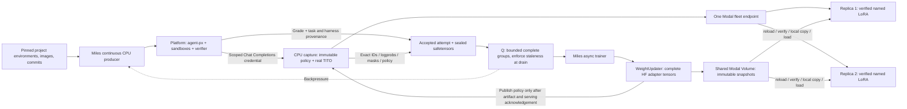

# Async platform RL with Miles and immutable Modal policies

This fork runs Miles's existing fully asynchronous trainer against Proximal feature tasks. The concrete target is a DeepSWE/Qwen3 LoRA hillclimb: one training cluster, a CPU rollout/capture plane, and independently managed Modal inference replicas. The standalone `trainer` repository is not another loop around Miles.

The implementation lives in `miles_plugins/proximal`. See [investigation](investigation.md), [platform contract](platform-contract.md), and [runbook](../../miles_plugins/proximal/README.md). This is executable integration code, with CPU tests of the actual Miles async worker, TITO core, sample codec, argument parser, and weight updater. It still requires the documented platform binding changes and live train/serve verification.

## Ownership and placement

| Capability | Existing home used by this implementation | Owner |
| --- | --- | --- |
| Optimizer, objective, advantages, GRPO, checkpoints | `train_async.py`, Megatron backend | Miles |
| Pinned feature-task selection and cursor | `DataSource` → `PlatformTaskSource` | Miles CPU |
| Continuous bounded production | `FullyAsyncRolloutFn` → `PlatformRolloutFn` | Miles CPU |
| Harness, tools, sandbox, verifier, operational logs | EnvironmentRun RPC + shared agent-px completion seam | Platform |
| Exact prompt/completion IDs and assistant loss masks | `SessionCore` + Qwen3 TITO + existing sample codec | Miles CPU capture service |
| Complete-group acceptance and consumption-time staleness | `DataBuffer` → `PlatformDataBuffer` | Miles |
| Train-to-serving transfer | `WeightUpdater` → `ModalVolumeTransfer` | Miles |
| Shared artifact transport | Immutable snapshot + existing Modal Volume | Miles publishes; platform mounts |
| Per-request policy selection and adapter slots | `ReplicaGateway` + `ReplicaLoRALoader` | Platform replica |
| Replica placement and all physical resource teardown | Existing platform/Modal lifecycle | Platform |

The trainer can cancel a logical run. It never deletes a platform container or makes training eligibility depend on teardown evidence. The adapter is harness-neutral; the platform certifies which harness revisions support the required capture contract.

## Policy publication and the shared Volume

An immutable policy is `(run_id, version, base name/revision, snapshot SHA-256)`. The snapshot hashes metadata, PEFT configuration, and complete adapter weights. Replica identity is intentionally absent. One fleet URL may route any request to any replica; every handling replica independently ensures that the selected adapter exists and verifies it before forwarding inference.

Publication uses the **existing weight-update boundary**, including its initial startup update. The protocol requests full TP/EP/PP gathering from Miles's HF iterator, copies adapter tensors to CPU on rank zero, writes safetensors and the training backend's authoritative PEFT configuration, and uploads immutable files to the existing Volume. The manifest is committed last, after readback verification. Native optimizer/resume checkpoints remain separate.

Only after the capture service obtains an acknowledgement from one replica does it commit the new policy. That acknowledgement warms one arbitrary container; it is not fleet-wide readiness. Every subsequent inference request carries the immutable selector and receives verified adapter/base identity headers. The capture service converts that evidence into Miles version spans. It does not trust SGLang's global base-weight counter for named adapters.

Other ranks participate in gathers and receive the publication verdict through Gloo. Failed publication leaves the updater version unchanged. One successful publication occurs at startup and after every training iteration; `max_policy_lag` counts these publications, not individual optimizer microsteps. Retrying a publication uses the same immutable identity.

A Volume shares files, not GPU state. Each replica reloads its mounted Volume, verifies the snapshot, copies it into a separate local cache, and registers `miles-<sha256>`. It keeps a bounded adapter-slot LRU with reference counts: an active generation cannot be evicted. An older rollout can reload its immutable adapter after idle eviction. Never overwrite a `latest` directory. The gateway and SGLang process share one lifetime and exclusively own this adapter namespace. On an ambiguous load/unload acknowledgement, fail closed and replace the replica; automatic repair is not part of this pass.

Base identity remains a trusted deployment assertion: the gateway checks SGLang's model path against configuration, and snapshots must match the declared base revision. It does not hash resident GPU weights. The initial live gate must measure train/serve logprob agreement. Pin the same base weights, tokenizer, Qwen3 rendering, reasoning parser, and LoRA targets/rank on both sides. Keep the engine's adapter capacity at least as large as the gateway's, with no other adapter writer.

## Capture and acceptance

Each prompt group selects one committed policy. Its members use distinct execution/session identities but the same task, harness, sampling contract and policy. Different groups can span versions within the configured lag.

The run configuration contains a pinned project membership subset, environment IDs, image IDs, source commits, harness revision and execution limits. The client checks project membership and training capabilities before creating a run. The platform must reject a different request reusing an execution identity and return the stored training request fingerprint on submission and final summary.

A capture session has its own credential, valid only for its recorded Chat Completions route. The platform receives that credential, not the capture administrator key or inference credentials. The capture server serializes inference and sealing for a session, rejects unrecorded routes and unsupported request semantics, and pins the policy even across replica replacement. Agent-requested streaming uses Miles's existing complete-response-to-SSE adapter; the backend generation is non-streaming.

TITO retains generated token IDs across turns. The sample codec supplies the training mask, including zero-mask tool/environment text between assistant spans. The first pass supports text-only linear Qwen3 traces, with one-step retry behavior inherited from Miles. It rejects compaction/subagents rather than retokenizing their outputs into a different training target.

Sampling is explicit: temperature 1, top-p 1, top-k -1, untransformed behavior logprobs, and an explicit per-turn/total token budget. `--use-rollout-logprobs` is mandatory so the policy ratio uses the behavior policy that generated the data. Broader distribution transforms need an explicit logprob convention before support. Near the context limit, generation is capped to the remaining budget; the accepted trajectory is never truncated after earning its grade.

Eligibility requires a successful/completed platform result with no execution error, a recorded finite verifier reward (including zero), exact source/image/request provenance, and a sealed capture with matching policy/fingerprint/checksum. Every loss-bearing token must have a finite logprob and a verified policy span. Missing capture, timeout, infrastructure failure, mixed policy, incomplete group, and unverifiable reward do not become fabricated zero-reward data. Consecutive failed groups exhaust an explicit failure budget.

## Q, overlap and recovery

Q is Miles's existing in-memory `DataBuffer` seam. Both in-flight groups and the completed backlog are bounded. The CPU producer stays active while the trainer computes and publishes; a full queue applies backpressure. Task selection cycles deterministically over the pinned list, with optional regeneration of discarded groups. Replica count is a platform scaling choice; Miles only declares workload concurrency.

The fully async driver drains the next batch **after** publication, immediately before consumption. Its former additional prefetch could select a batch against an outdated version. Semi-async prefetch behavior is preserved. Shutdown cancels and awaits producer children and requests logical cancellation for unfinished platform runs.

Sealed captures and accepted attempts are immutable, checksum-addressed local artifacts. Seal can be retried and collected after capture-service restart. Unsealed sessions are lost explicitly; an old execution identity cannot silently bind to a newly created session. The data source checkpoints its dataset fingerprint, cursor, and retry task indices alongside the native training checkpoint.

This pass does **not** claim exactly-once optimizer recovery. Completed/in-flight queue state is not durably claimed; interrupted work is regenerated. Resume from the latest matching native checkpoint with the same artifact store. Rolling back behind the capture service's publication history requires a new run ID. A durable Postgres queue can later implement the existing buffer seam, but also needs optimizer checkpoint/claim acknowledgement; `SKIP LOCKED` alone would not supply that guarantee.

The platform owns sandbox retention. The operator owns retention for local accepted samples, replica disk caches, and immutable Volume versions; this pass never deletes artifact history. Size storage for the run and measure high-rank adapter export/upload/refresh latency. Replace the transport only if measurements justify it.

## First-pass limits and verification

The supported path is a single Megatron actor cell, bridge-exported LoRA, an independent external serving fleet, complete prompt groups, and explicit rollout-logprob correction. No critic, multi-LoRA trainer, independent-DP failover, shared in-process inference, separate evaluation fleet, compaction, multimodal samples, or speculative/replay payloads. Unsupported modes fail during free argument validation.

CPU tests use real tensors, Gloo, Miles weight/update/async/TITO/codec machinery, a pinned Qwen3 tokenizer, HTTP fixtures and substituted Modal I/O. They establish control-plane and trace correctness. They do not establish GPU numerical equivalence, successful live feature-task execution, Modal routing/Volume latency, or DeepSWE learning improvement. The [runbook](../../miles_plugins/proximal/README.md) defines those subsequent gates.
