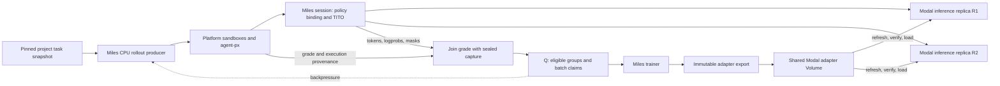

# Proximal platform rollouts and independent policy replicas

This fork uses Miles as the learning foundation and Proximal as the executor of complete tasks. This document records the agreed direction and distinguishes the first executable slice from planned integrations. The standalone `trainer` repository's driver is not nested around Miles.

## Ownership

| Capability | Owner |
| --- | --- |
| Training schedule, groups, advantages, loss, optimizer | Miles |
| Task selection | Miles CPU data source/rollout producer, using a pinned platform project snapshot |
| Agent-px harness, tools, sandbox, verifier and operational artifacts | Proximal platform |
| Exact input/output tokens, logprobs, masks | Miles TITO session machinery |
| Checkpoint export and logical policy publication | Miles publication integration |
| Modal serving, replica placement and all physical resource teardown | Platform |
| Grade/capture/provenance acceptance and staleness | Miles generate/buffer boundaries |

The trainer can request cancellation of a logical platform run. It does not delete platform containers or require container teardown evidence to accept a sample. Harness selection is generic; supported inference/capture capabilities must be validated per harness.

## Implemented in the first slice

`miles_plugins.proximal` prepares a content-addressed PEFT bundle, publishes it to an **existing** Modal Volume, and verifies/copies/registers it inside an **existing** SGLang replica. The local export can run through Miles's existing Megatron post-save hook. Commands and validation are in the [usage guide](../../miles_plugins/proximal/README.md).

Three facts remain separate:

1. **Saved checkpoint:** native resume state exists; the optional serving export may have failed.
2. **Published artifact:** the complete manifest and serving bytes are committed and integrity-checked.
3. **Registered adapter:** one local SGLang process acknowledged a particular immutable adapter name/path.

Registration is not a generation smoke, numerical compatibility proof, hardware residency guarantee, or fleet-wide readiness certificate. This slice never advances Miles's live weight version and does not replace its current internal engine management. The post-save hook does local export only; remote publication is a separate explicit operation.

### Placement decisions

- **Post-save hook versus optimizer code:** reuse the hook for local export; tensor updates and loss code do not own artifact distribution. Publication cadence/startup readiness will ultimately belong at the existing train-to-inference update boundary, not merely checkpoint cadence.
- **Replica-local registration versus a load-balanced load request:** register against the replica's loopback SGLang process. A request to an autoscaled endpoint reaches one container and is not a broadcast. Future serving wrappers can reuse this operation at startup/prewarm/request admission.
- **Existing async buffer versus a second scheduler:** Q belongs behind Miles's existing DataBuffer seam. No queue service or central scheduler is introduced here.

Function-specific arguments/validation now work on post-save hooks using the same `add_arguments` convention as rollout/generate hooks. Validation runs in the existing argument validation stage, before trainer/rollout resources are created. Hooks without these optional attributes retain their behavior.

## Policy identity and file distribution

A policy version identifies immutable base weights plus an immutable adapter. A replica is a replaceable process. A long rollout remains on its selected policy even when newer versions are published; failover may choose another replica only when it serves that policy.

The snapshot manifest contains a declared base checkpoint name/revision, run identity, Miles checkpoint iteration and hashes/sizes of serving files. Its SHA-256 digest determines both the storage path and SGLang adapter name. Changing metadata or bytes produces another identity. The base revision is an operator declaration to be matched to actual serving startup configuration; this helper does not measure the resident base weights.

Checkpoint iteration is deliberately named: Miles supplies `rollout_id` to the hook, which need not equal optimizer update count. Future staleness enforcement must record and use the intended optimizer-step/version mapping explicitly.

A shared Volume distributes files, not loaded GPU state. Publication uploads files without replacement, checks the uploaded bytes, then uploads the manifest as the completion marker. Interrupted attempts can resume; conflicting bytes fail. Each replica refreshes the mount, verifies the manifest/files, copies into its own cache and registers a unique name. Retain old versions while referenced; this first slice never unloads or deletes them.

One loader belongs to one SGLang process lifetime. Its owner must recreate it on engine restart and exclusively manage this adapter namespace. HTTP failures, including an ambiguous successful load whose response was lost, propagate; there is no automatic unload/reload or retry that could change weights underneath an active rollout. Reconciliation after such failures remains future work.

High-rank adapters can be hundreds of MB or GB. Measure export, upload/readback, refresh/copy and registration latency before choosing publication frequency or replacing Volume transport with direct networking. Modal i6pn/RDMA are potential later optimizations, not required by this slice.

## Planned rollout integration

Use a thin custom generate adapter composing existing Miles tracing/assembly with platform RPC execution. The platform gets the pinned task, harness and scoped inference binding. Sampling policy stays at the Miles session/serving boundary, with explicit budget composition. Platform operational traces and training artifacts are cross-linked by IDs; exact tokens have one authority.

Accept a training sample only after joining a valid verifier grade, sealed capture and matching task/harness/policy provenance. A graded incorrect solution may have reward zero. Infrastructure, verifier or capture failures are ineligible attempts, not synthesized zero rewards.

The reviewed platform RPC supports named endpoints but does not yet inject a per-rollout Miles session URL. Its current Modal client uses Responses; Miles's generic Responses proxy is not a recorded TITO path. The first integration should use the recorded Chat Completions route. Existing fake-SSE support can serve a streaming harness while collecting a complete backend response.

Required follow-up work includes typed inference binding in the shared platform client seam, session-specific policy/sampling enforcement, authenticated reachable CPU session hosting, sealed/retryable collection, version provenance and external serving integration. Current Miles LoRA version checks and external-engine flags do not provide this complete contract.

## Q and continuous production

A project supplies the dataset source; freeze task membership, source/image revisions and harness/verifier settings for reproducibility. Miles's existing CPU async producer can continuously refill work while the optimizer trains. Keep both in-flight attempts and usable completed groups bounded so the fleet does not generate an unbounded stale backlog.

Q can use a transactional database claim rather than a queue product. Platform environment-run results currently use Mongo, while projects and agent-run journals use Postgres. Training eligibility/consumption records must be explicit and linked to operational runs; existing execution claims are not optimizer-consumption claims.

For GRPO, claim complete prompt groups with valid grading, captured artifacts, compatible policy identity and the requested staleness bound. Persist batch membership and reconcile claim/ack state with the restored training checkpoint. SQL row locks do not themselves provide exactly-once optimizer updates. The existing DataBuffer `put/get/get_metrics` seam also needs training-step acknowledgement integration for durable recovery.

## Validation progression

1. **This PR:** CPU tests of snapshot integrity, partial/conflicting uploads, independent replica loaders, registration errors and engine replacement. Modal's SDK is substituted at its network boundary; SGLang is represented by loopback HTTP fixtures. No model weights are deserialized or generated against.
2. **First actual rollout:** one frozen compatible policy, one platform task, CPU TITO service/driver and a persisted Miles Sample. No training GPU needed.
3. **Shared-volume serving test:** two real replicas and two existing compatible adapters; publish vB during a vA rollout, test version selection and replica replacement, measure distribution latency.
4. **Actual training update:** integrate the existing train-to-inference update boundary, export/publish a newly trained adapter, verify train/serve math, staleness and recovery. Broader compaction, multi-policy branches and asynchronous overlap follow explicit learning contracts.

This code does not provision or tear down Volumes, containers, GPU jobs or replicas. Live operations require separate run authorization; writing this prototype and passing CPU tests does not establish deployed compatibility.

## References

- [Miles environment integration layers](../user-guide/environments.md)
- [Miles LoRA training](../advanced/lora.md)
- [Modal Volume semantics](https://modal.com/docs/guide/volumes)
- [Modal server routing](https://modal.com/docs/guide/servers)
- [SGLang LoRA serving](https://docs.sglang.io/docs/advanced_features/lora)
