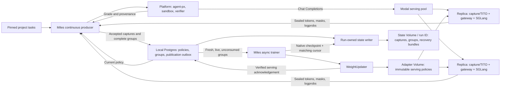

# Async platform RL with Miles and immutable Modal policies

This fork runs Miles's existing fully asynchronous trainer against Proximal feature tasks. The concrete target is a DeepSWE/Qwen3 LoRA hillclimb: one training cluster, a CPU rollout plane and independently managed Modal inference replicas with capture. The standalone `trainer` repository is not another loop around Miles.

The implementation lives in `miles_plugins/proximal`. See [investigation](investigation.md), [platform contract](platform-contract.md), and [runbook](../../miles_plugins/proximal/README.md). This is executable integration code, with CPU tests of the actual Miles async worker, TITO core, sample codec, argument parser, and weight updater. It still requires the documented platform binding changes and live train/serve verification.

## Ownership and placement

| Capability | Existing home used by this implementation | Owner |
| --- | --- | --- |
| Optimizer, objective, advantages, GRPO, checkpoints | `train_async.py`, Megatron backend | Miles |
| Pinned feature-task selection and cursor | `DataSource` → `PlatformTaskSource` | Miles CPU |
| Continuous bounded production | `FullyAsyncRolloutFn` → `PlatformRolloutFn` | Miles CPU |
| Harness, tools, sandbox, verifier, operational logs | EnvironmentRun RPC + shared agent-px completion seam | Platform |
| Exact prompt/completion IDs and assistant loss masks | `SessionCore` + Qwen3 TITO + existing sample codec | Miles capture service on each inference replica |
| Complete-group acceptance, durable storage, batch query with consumption-time staleness | `DataBuffer` → `PlatformDataBuffer` over `RolloutStore` (Postgres index + payloads on a durable mount) | Miles |
| Consumption ledger (which groups this run trained on) | `DataSource` checkpoint → `PlatformTaskSource` | Miles |
| Finite collection and later independent training | Existing `PlatformRolloutFn` producer; immutable group selection → `FrozenBatchRolloutFn`; native `train.py` | Miles |
| Policy registry: which immutable adapter each version names, and lineage on resume | `RolloutStore` policies table | Miles |
| Train-to-serving transfer | `WeightUpdater` → `ModalVolumeTransfer` | Miles |
| Shared artifact transport | Immutable snapshot + existing Modal Volume | Miles publishes; platform mounts |
| Serving pool: image, SGLang arguments, LoRA settings, replica bounds | `serving.py` + `serving_app.py` (Modal `app.server`), derived from the run config | Miles |
| Per-request policy selection and adapter slots | `ReplicaGateway` + `ReplicaLoRALoader`, one per replica | Miles serving pool |
| Endpoint selection for rollouts | Platform endpoint registry records the pool's URL | Platform |
| Sandboxes and all rollout resource teardown | Existing platform lifecycle | Platform |

The trainer can cancel a logical run. It never deletes a platform container or makes training eligibility depend on teardown evidence. The adapter is harness-neutral; the platform certifies which harness revisions support the required capture contract.

```mermaid
flowchart LR
    D["Pinned project tasks"] --> P["Miles continuous producer"]
    P --> S["Platform: agent-px, sandbox, verifier"]
    S -->|"Chat Completions"| F["Modal serving pool"]
    F --> R1["Replica: capture/TITO + gateway + SGLang"]
    F --> R2["Replica: capture/TITO + gateway + SGLang"]
    T["Miles async trainer"] --> W["WeightUpdater"]
    W --> AV["Adapter Volume: immutable serving policies"]
    AV --> R1
    AV --> R2
    W -->|"Verified serving acknowledgement"| DB["Local Postgres: policies, groups, publication outbox"]
    DB -->|"Current policy"| P
    R1 -->|"Sealed tokens, masks, logprobs"| P
    R2 -->|"Sealed tokens, masks, logprobs"| P
    S -->|"Grade and provenance"| P
    P -->|"Accepted captures and complete groups"| DB
    DB -->|"Fresh, live, unconsumed groups"| T
    DB --> SW["Run-owned state writer"]
    T -->|"Native checkpoint + matching cursor"| SW
    SW --> SV["State Volume / run ID: captures, groups, recovery bundles"]
```

## Policy publication and the shared Volume

An immutable policy is `(run_id, version, base name/revision, snapshot SHA-256)`. The snapshot hashes metadata, PEFT configuration, and complete adapter weights. Replica identity is intentionally absent. One fleet URL may route any request to any replica; every handling replica independently ensures that the selected adapter exists and verifies it before forwarding inference.

Publication uses the **existing weight-update boundary**, including its initial startup update. The protocol requests full TP/EP/PP gathering from Miles's HF iterator, copies adapter tensors to CPU on rank zero, writes safetensors and the training backend's authoritative PEFT configuration, and uploads immutable files to the existing Volume. The manifest is committed last, after readback verification. Native optimizer/resume checkpoints remain separate.

Only after one replica acknowledges the uploaded snapshot does the publisher commit the version to the rollout store, which is the single policy authority. That acknowledgement warms one arbitrary container; it is not pool-wide readiness. The producer pins new groups to the store's latest committed version, and the capture service admits a session only for a policy the store holds.

The first publication of each trainer process rewinds the store to the resumed checkpoint: versions after it named weights the resume discarded, so they are marked abandoned. The version republished at startup comes from the checkpoint's own weights; identical weights restore it, different weights replace it. The batch query joins stored groups to live policies by exact snapshot hash, so a group sampled from abandoned weights is never trained on. Every subsequent inference request carries the immutable selector and receives verified adapter/base identity headers. The capture service converts that evidence into Miles version spans. It does not trust SGLang's global base-weight counter for named adapters.

Other ranks participate in gathers and receive the publication verdict through Gloo. Failed publication leaves the updater version unchanged. One successful publication occurs at startup and after every training iteration; `max_policy_lag` counts these publications, not individual optimizer microsteps. Retrying a publication uses the same immutable identity.

A Volume shares files, not GPU state. Each replica reloads its mounted Volume, verifies the snapshot, copies it into a separate local cache, and registers `miles-<sha256>`. It keeps a bounded adapter-slot LRU with reference counts: an active generation cannot be evicted. An older rollout can reload its immutable adapter after idle eviction. Never overwrite a `latest` directory. The gateway and SGLang process share one lifetime and exclusively own this adapter namespace. On an ambiguous load/unload acknowledgement, fail closed and replace the replica; automatic repair is not part of this pass.

Base identity remains a trusted deployment assertion: the gateway checks SGLang's model path against configuration, and snapshots must match the declared base revision. It does not hash resident GPU weights. The initial live gate must measure train/serve logprob agreement. Pin the same base weights, tokenizer, Qwen3 rendering, reasoning parser, and LoRA targets/rank on both sides. Keep the engine's adapter capacity at least as large as the gateway's, with no other adapter writer.

## Capture and acceptance

Each prompt group selects one committed policy. Its members use distinct execution/session identities but the same task, harness, sampling contract and policy. Different groups can span versions within the configured lag.

The run configuration contains a pinned project membership subset, environment IDs, image IDs, source commits, harness revision and execution limits. The client checks project membership and training capabilities before creating a run. The platform must reject a different request reusing an execution identity and return the stored training request fingerprint on submission and final summary.

A capture session has its own credential, valid only for its recorded Chat Completions route. The platform receives that credential, not the capture administrator key or inference credentials. The capture server serializes inference and sealing for a session, rejects unrecorded routes and unsupported request semantics, and pins the policy even across replica replacement. Agent-requested streaming uses Miles's existing complete-response-to-SSE adapter; the backend generation is non-streaming.

TITO retains generated token IDs across turns. The sample codec supplies the training mask, including zero-mask tool/environment text between assistant spans. The first pass supports text-only linear Qwen3 traces, with one-step retry behavior inherited from Miles. It rejects compaction/subagents rather than retokenizing their outputs into a different training target.

Sampling is explicit: temperature 1, top-p 1, top-k -1, untransformed behavior logprobs, and an explicit per-turn/total token budget. The behavior correction is explicit (`research.behavior_correction`): `rollout_logprobs` (`--use-rollout-logprobs`) makes the rollout engine's log-probs the PPO ratio's denominator; `truncated_importance_sampling` (`--use-tis`, explicit `clip` and `clip_low`) recomputes that denominator in the trainer and weights each token by the truncated rollout-to-trainer importance ratio, the decoupled form that tolerates groups several policy versions old. Broader distribution transforms need an explicit logprob convention before support. The sampling contract declares the token ceiling once; the platform adapter derives its `maxSessionTokens` execution limit from that same value. Near the context limit, generation is capped to the remaining budget; the accepted trajectory is never truncated after earning its grade.

Eligibility requires a successful/completed platform result with no execution error, a recorded finite verifier reward (including zero), exact source/image/request provenance, and a sealed capture with matching policy/fingerprint/checksum. Every loss-bearing token must have a finite logprob and a verified policy span. Missing capture, timeout, infrastructure failure, mixed policy, incomplete group, and unverifiable reward do not become fabricated zero-reward data. Consecutive failed groups exhaust an explicit failure budget.

## Q, overlap and recovery

Q is Miles's `DataBuffer` seam, backed by the durable rollout store. `put` validates a complete group and persists it: Miles's sample codec payload (the v2 field set, which carries the reward) on the artifact mount, then one small Postgres index row carrying the group's policy version, snapshot hash and training-contract digest. The group is stored before any backpressure because it is a paid rollout.

The artifact mount is an explicit choice. For a Modal Volume, the writer commits the Volume after writing a payload and before inserting its row, and a reader that finds a row but not its file reloads the Volume and retries once; a checksum still has to match. A shared disk is valid only when every reader and writer mounts the same filesystem. The store is always opened through one function that takes both the contract digest and this sync behavior from the run config.

The training-contract digest covers everything that changes what a group means as training data: base model, pinned dataset, harness revision and limits, sampling, LoRA shape, tokenizer, TITO/thinking settings and the model's reasoning/tool-call parsers. The batch query only selects groups with the consuming trainer's digest, and `get` re-validates each loaded group's full evidence, for every member, against the run config before training on it. The producer then pauses while more than `completed_group_capacity` fresh, unconsumed groups are waiting, matching Miles's default bounded buffer.

`get` is the batch query. It selects the oldest group that is within `max_policy_lag` of the trainer's committed version, was sampled from live (not abandoned) weights, and is not in this run's consumption ledger. It records the group in the ledger and returns it. Staleness is evaluated at consumption; stale groups are simply never selected, so nothing needs deleting or recycling. There is no ownership tag and no global "consumed" flag. The query is scoped to one training run and its policy lineage. An independent experiment can explicitly freeze a selection into an offline bundle; this never changes the online consumption ledger or makes an abandoned policy live.

The consumption ledger is trainer state, saved through the task source alongside the dataset fingerprint, cursor, and retry task indices. Miles saves this state immediately after the weights for the same step, and it is overwritten when a resumed run saves that step again. Resuming a complete checkpoint restores the ledger saved with its weights, so groups consumed by discarded steps become selectable again if still fresh. A step whose weights exist but whose state does not (an interrupted save) refuses to resume; the operator resumes the previous complete step. Restoring a step first deletes any saved state for later steps (all steps, on a fresh start) before training writes new weights, so a crash between re-saving a step's weights and its state cannot pair them with the abandoned timeline's ledger. This is not exactly-once consumption across a crash between optimizer step and save: the steps after the last complete checkpoint are retrained, possibly on different groups. A restarted process sees every stored group, so completed paid rollouts survive a crash. Groups still in flight when a process dies are regenerated. Entries below the staleness window are pruned because staleness only grows.

The fully async driver drains the next batch **after** publication, immediately before consumption. Its former additional prefetch could select a batch against an outdated version. Semi-async prefetch behavior is preserved. Shutdown cancels and awaits producer children and requests logical cancellation for unfinished platform runs.

Sealed captures and accepted attempts are immutable, checksum-addressed artifacts. Seal can be retried and collected after capture-service restart. Unsealed sessions are lost explicitly; an old execution identity cannot silently bind to a newly created session.

One trainer consumes each run's store, so no row locking or leases are needed. They become necessary only if several consumers ever share one training run.

## Capture: Miles session front, reached through the platform's endpoint registry

Decided: the capture service (Miles's session code) stays in the inference path. The platform's endpoint registry points agent-px at it with a per-rollout base URL, `<capture>/rollouts/<platform rollout id>/v1`, and a static credential; the capture service renders exact prompt tokens (TITO), calls the serving pool non-streaming, and records output tokens and logprobs. The platform returns only the grade; it never handles tokens. Miles creates runs with existing run API fields only. See [platform-contract.md](platform-contract.md) for the one platform change and for how agent-px's requests are normalized (cache hints ignored, reasoning effort pinned, `strict` tools unconstrained, loose tool-call matching).

Capture runs with each inference replica. Its session memory grows with turns times context (Miles keeps each turn's full prompt IDs). The trainer collects the sealed result there and releases it after the state publisher acknowledges the durable copy.

The platform owns sandbox retention. The operator owns retention for stored groups, local accepted samples, replica disk caches, and immutable Volume versions; accepted captures and group payloads are retained; the run-state writer prunes only recovery bundles under its run namespace. Size storage for the run and measure high-rank adapter export/upload/refresh latency. Replace the transport only if measurements justify it.

## First-pass limits and verification

The supported path is a single Megatron actor cell, bridge-exported LoRA, an independent external serving fleet, complete prompt groups, and explicit rollout-logprob correction. No critic, multi-LoRA trainer, independent-DP failover, shared in-process inference, separate evaluation fleet, compaction, multimodal samples, or speculative/routing-replay payloads. Unsupported modes fail during free argument validation.

The serving engine retains its loopback API-key authentication. The pinned SGLang
build does not support that authentication with multiple tokenizer workers, so
serving argument validation requires one worker before allocating replicas.

## Disjoint rollout collection and a training step

P0: storage happens at the shared attempt/result and group-store seams, whether
the producer belongs to online training or a CPU-only collection job. Each launch
first archives its immutable request; accepted results archive the existing exact
sample codec and grade evidence before releasing capture. Failed/cancelled attempts
retain an explicit outcome and any sealed capture that can be recovered. A request
without a terminal record after a crash is unknown, never a fabricated zero reward.
Training eligibility and batch selection do not control artifact retention.
Repeated graceful shutdown signals do not interrupt accepted or failed-result
handoffs. A local storage error preserves a recoverable replica capture; it is
never reclassified as unavailable capture. Batch and initial-policy copies verify
bytes against the already validated manifest hashes before publishing readiness.

The CPU collector owns an artifact-only instance of the existing state publisher.
`modal_training --rollouts-persist-to-volume` uses the deployment's configured
state Volume; `--collect-rollouts N` selects a CPU-only run. Online training already
uses the same persistence path. No additional store service or manual commit is
exposed to the operator.
It commits results incrementally and automatically publishes a self-contained
batch when the requested complete groups have arrived. Finite collection admits
only the requested number of new prompt groups through `PlatformTaskSource`;
failed groups retry the same task after all their launched siblings finish.
The existing submission scheduler idles when that source has no remaining work.
Successful collection therefore waits for every admitted rollout and its durable
handoff before the run owner stops serving. Failure or explicit cancellation still
reaches the run's bounded cleanup path. An interrupted collection
can select already committed groups later without the old database. The P0 format
keeps the proven lossless codec and self-contained group/batch copies; replacing
those copies with references is a later storage optimization, not a prerequisite
for correct detached training.

The durable data unit is the existing complete-group payload, including rewards,
exact tokens, assistant masks, behavior logprobs and typed acceptance evidence.
An immutable `FrozenBatch` manifest orders those groups, hashes their payloads,
records the source run contract and explicitly names the behavior policy. It is
an artifact at the existing data-plane seam, not another training coordinator.
This first pass selects one exact policy per batch. Raw ungraded captures and
partial groups cannot be frozen as training batches.

Explicit cross-collection assembly uses a version-2 frozen manifest. Its primary
source remains the training/checkpoint anchor; additional source contracts retain
their original pinned datasets and collection group sizes. Dataset membership may
differ within one project. Explicit regrouping may also combine samples from
different collection group sizes into the anchor's fixed training group size.
Run, exact behavior policy, base, harness, sampling, LoRA and token/rendering
contracts must match. Each group is validated against the source identified by its
original contract digest; neither its header nor its sample evidence is rewritten.
Online buffer matching remains exact. Assembly takes explicit ordered group IDs
from immutable input bundles, rejects duplicate groups/attempts and optionally
requires nonzero reward variance. It copies verified original codec bytes and
publishes its manifest last. A v2 manifest separately records source payloads and
ordered training-group selections by original group ID and offset within the original payload.
Every source payload is validated in full before selecting members. Each training
group must have the anchor's group size, one exact task/image/commit, and no repeated
attempt; acceptance metadata is never rewritten to pretend separate launches were
one original group. For four-rollout retries of an all-zero task, choose four old
sample offsets before launching and combine all four new samples. Variance filtering
applies to the resulting training group, not its all-zero source group. This is an
explicit adaptive sampling recipe, not eight independent fresh draws.
The ordinary frozen rollout consumer handles both
manifest versions, including offline validation and native Miles conversion.

CPU collection IDs are minted on the launch host and passed as retry-stable Modal
inputs. Before any rollout/publication, the worker commits an invocation record.
A completed retry validates and returns its existing batch; an interrupted retry
fails closed before creating new requests. This is a replay guard, not automatic
resumption of volatile capture sessions or a distributed lease. One active owner
per collection remains required. Artifact-only collectors may share a state Volume
under one immutable behavior policy: each owns a distinct invocation/collection
directory and UUID attempt/group paths, publishes no trainer checkpoint or LATEST,
and has its own local index/outbox. They never update the same file. Only one active
trainer may own the run's checkpoint/publication lineage. The CPU collector can explicitly opt into non-preemptible Modal
capacity; this does not replace the durable guard or promise survival of all faults.

`collect_batch` composes `PlatformTaskSource`, `PlatformRolloutFn` and its existing
buffer on CPU. It drains complete groups incrementally, freezes the requested
count, then closes the producer. It neither initializes an optimizer nor
publishes weights. Finite admission prevents speculative extra groups beyond the
requested batch. Retries can still incur additional paid attempts; all are retained,
and the requested count is the accepted batch size, not a billing limit.

Later, `FrozenBatchRolloutFn` reads only the bundle through the ordinary Miles
rollout-function seam. Miles still performs reward normalization, advantages,
logprob recomputation/correction, partitioning, backward and optimizer updates.
The offline launcher owns checkpoint validation and invokes native `train.py`
in train-only mode, without Postgres, platform or serving clients. A batch of
1,024 trajectories at group size 8 means 128 groups and global batch size 1,024
for one optimizer update; microbatching remains Miles's responsibility.

Training initialization is separate from the data artifact. Explicit fresh mode
loads the pinned base and initializes trainable LoRA plus a new optimizer. CPU
collection can publish a zero-delta serving adapter, constructed from the base
checkpoint's tensor shapes without loading its weights into a GPU. The immutable
serving snapshot is retained with the batch; fresh training verifies its identity,
shape and zero delta. It never loads that serving-only adapter as trainable weights.
Native resume requires a retained, verified recovery checkpoint from the source
run, the same parallel layout, and explicit optimizer-state resume.
Serving PEFT exports are not training checkpoints: this fork's Megatron loader
does not import them. The selected batch must fit the checkpoint's policy-lag
window. A policy version number alone is not proof of equal weights across
abandoned histories; source checkpoint/behavior lineage must be chosen deliberately.
No automatic 8-to-64-GPU resharding or creation of an initial trainer checkpoint
from a serving-only adapter is implemented. See [offline batch runbook](offline-batches.md).

An explicitly authorized two-update comparison can reuse one verified base-policy
batch across fresh LoRA parameterizations. The bounded `e2e.batch_sweep` composes
`ReferenceReplay`, the existing clustered sizing lifecycle, and native `train.py`.
This is deliberate experimental replay; the production frozen consumer still admits
one update, and native resume still requires an identical target layout. The batch's
original contract, tokens, masks, behavior logprobs and provenance remain unchanged.
The sweep records its own target list and optimizer recipe alongside the source
manifest hash and verifies the original zero-delta policy proof before allocation.
CPU preflight uses the pinned image's native argument parser, HF model validation,
and sweep-contract checks. Megatron's full validator queries the CUDA architecture
for tensor parallelism; it runs on the allocated gang before model loading.
Each configuration starts a fresh model/optimizer and executes its two consecutive
updates on live workers. The run retains its Modal nodes, Ray cluster and local kernel
caches across configurations. Native saves remain a training capability; the existing
snapshot helper separately packages each completed PEFT export for evaluation.
Every node commits its own global-rank native/optimizer shards after the native save
barrier. Only after all nodes' receipts and hashes validate does the owner certify the
native checkpoint and commit an evaluation snapshot plus a per-step completion receipt.
Publication failure aborts the experiment; the run never reports an incomplete export
as ready. Output lives in an isolated experiment namespace, not the source run's
online policy/checkpoint lineage. No automatic restart or resume of a partially
completed experiment is allowed. Cluster cleanup preserves all committed artifacts.

CPU tests use real tensors, Gloo, Miles weight/update/async/TITO/codec machinery, a pinned Qwen3 tokenizer, HTTP fixtures and substituted Modal I/O. They establish control-plane and trace correctness. They do not establish GPU numerical equivalence, successful live feature-task execution, Modal routing/Volume latency, or DeepSWE learning improvement. The [runbook](../../miles_plugins/proximal/README.md) defines those subsequent gates.

## Durable Modal run state (PRO-1075)

The run composition root mounts a state Volume at `/snapshot`, with a namespace
per run ID. This is separate from the serving adapter Volume. Postgres and working
files stay on local disk; replicas and sandboxes never mount the state Volume.

The `run_state` artifact-storage variant uses a small publication outbox in the
existing local Postgres. It is transport bookkeeping, not another training queue.
Completed captures stage their exact codec bytes and typed acceptance record, then
wait for the run's one publisher to commit payloads and commit completion records
in that order. Only that acknowledgement permits capture release. Pending work is
bounded by the existing rollout concurrency and token limits; publication batches
have a byte ceiling. A storage outage backpressures completion, without rerunning
paid inference. Checkpoint publication shares the same writer.

Complete groups also publish an immutable index (policy, contract, membership,
checksum and stable ordering time). Restore reconciles indexes missing from the
selected database dump without reviving policies or importing a newer consumption
ledger. Only eligible group payloads return to local disk. Historical accepted
captures remain in the Volume.

New recovery checkpoints are immutable `checkpoints/<step>-<digest>` bundles.
Their manifest binds every native rank shard, optimizer/scheduler/RNG shard,
task cursor and database dump to the run, launch and parent checkpoint. Data is
committed before the manifest and the manifest before `LATEST`. Readers verify
hashes, completeness and the compatible training layout before restoring. The
native LoRA writer owns the all-ranks completion record and RNG state. Serving
exports do not certify a training checkpoint.

The Modal launcher records each launch's config and supports explicit fresh/latest/
checkpoint selection. Existing integer `LATEST` snapshots retain a compatibility
reader; legacy state cannot acquire missing RNG/completeness evidence retroactively.
The state writer performs a final drain and snapshot on graceful shutdown. Abrupt
loss resumes only the last committed optimizer boundary. Async scheduling and
nondeterministic kernels prevent a bit-identical whole-run continuation guarantee.
Capture-release shutdown explicitly removes finished tasks and awaits only work
owned by its event loop, so queued completion callbacks cannot stall the drain.

Checkpoint retention keeps the newest two published bundles and explicit pins;
accepted captures and group payloads are not deleted. Volume deletion is never
compute cleanup. One active trainer per run remains a launch invariant: a Volume
file is not a distributed lease. Automated failover with a possibly live old owner
is unsupported. Platform artifact registration/CPU downloads are a separate change.

Durability starts at the acknowledged Volume handoff, not at model generation.
A failed capture read (including timeout or invalid payload) records an unknown
capture and does not authorize replica release, unless the platform explicitly
certifies that the rollout never started (`LaunchFailed`). This preserves the replica's
existing recovery opportunity; it does not extend its session expiry or provide
automatic reconciliation. Capture sessions are still volatile until sealed on
replica-local disk and handed off. A hard collector/replica loss before handoff can
lose generated tokens, including an already graded result. Complete-group indexes
are independently recoverable; individual accepted captures survive without them,
but recovery does not yet reconstruct missing group indexes from those captures.
