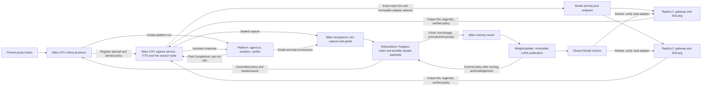

# Capture topology proposal: retain the extra hop for the first live run

**Decision for the next step:** keep `agent-px -> Miles CPU capture service -> Modal serving pool`. Direct agent-px calls to the replica gateway, with platform-owned continuation and training evidence, are the preferred longer-term direction. They are not required for the first live rollout.

This is a documentation-only proposal. The baseline is merged [PR #1](https://github.com/Proximal-Labs/miles/pull/1) at `db0b6dc67`. The selected next-step wiring is pending [PR #3](https://github.com/Proximal-Labs/miles/pull/3) at `05f876d08`, stacked on the [Stage A harness, PR #2](https://github.com/Proximal-Labs/miles/pull/2). The platform registry extension and a live end-to-end run remain outstanding. CPU fixture results do not establish live platform compatibility or train/serve numerical agreement.

The downstream goal remains a DeepSWE/Qwen3 LoRA hillclimb on platform feature tasks: one Miles training cluster, continuous bounded rollout production, independent Modal inference replicas, and a durable queue that enforces policy staleness at consumption.

## Near-term topology and ownership

The capture service is a CPU process with its own address. The diagram does not require model traffic to enter the training GPU process or even the training cluster. Place capture where the platform workers and serving pool can reach it. Local rehearsal can share a network with a local platform worker; staging requires a reachable authenticated HTTPS endpoint. The first deployment location is still to be chosen.

Miles's existing `SessionCore`, Qwen3 TITO renderer, message matcher, and sample assembly remain the authority for exact training tokens. Capture renders each prompt using retained generated token IDs, sends those IDs to the pool, and records output IDs, behavior logprobs, and verified policy identity. It returns ordinary assistant messages to agent-px. The platform does not need to transport or persist token/logprob evidence in this version.

Replicas share the immutable adapter files on a Modal Volume, not GPU memory or live capture state. Each gateway ensures the requested adapter is locally available and loaded. An active rollout stays pinned to one immutable policy, but its calls need not use one physical GPU replica. New groups can use newer published policies while earlier groups finish. The producer supplies work continuously subject to capacity and staleness rules; replicas serve that work rather than selecting dataset tasks themselves.

The platform owns tools, sandbox execution, verifier grading, and all rollout-resource teardown. Miles may request logical cancellation. Training eligibility never depends on trainer-side container cleanup.

## Why keep capture separate now?

| Placement | Benefit | Cost or missing work | Decision |
| --- | --- | --- | --- |
| Separate Miles CPU capture service | Reuses Miles's live session and sample machinery; platform changes remain at endpoint selection | Extra network hop; process-local state; lost unsealed attempts after restart; memory grows with concurrent trace histories | Use for the first live integration |
| Python TITO in each replica gateway; platform carries state and records evidence | Removes the separate capture hop; compatible replicas can continue a run from durable platform state | New continuation format for Miles internals; shared agent-px completion/journal/recovery changes; evidence export contract; larger platform payloads | Preferred longer-term direction |

Moving state into replica-local memory alone would require session affinity and couple rollout survival to GPU-container lifetime. A shared session database would add a per-turn state dependency. Neither is part of this proposal.

The first design should prove correct samples from real platform tasks before introducing a serialized representation of Miles session internals. Revisit placement when measured capture latency, memory/concurrency limits, or lost-rollout cost justifies the larger platform change. Removing one service hop does not itself prove lower end-to-end latency.

## Platform changes for the first run

Follow the [platform contract at PR #3's inspected revision](https://github.com/Proximal-Labs/miles/blob/05f876d0834f68be5992c2fd2c061c32dd6c16b2/docs/proximal/platform-contract.md). It supersedes the capability/training-binding proposal on current main for this next step. The platform owns the final typed registry schema.

Extend the existing endpoint-selection and per-run snapshot path to support:

1. **Chat Completions adapter selection.** Select agent-px's existing adapter for the capture endpoint. Existing Modal Responses entries retain their behavior. Do not add a parallel agent loop or per-harness HTTP client.
2. **A credential reference.** Resolve a named secret on the rollout worker when constructing the client. Store the reference, never the resolved key, in endpoint snapshots; exclude the key from traces, logs, and run metadata. PR #3 uses a static platform-to-capture data-plane credential, distinct from capture administration and inference credentials. It is not a per-run security capability.
3. **A deterministic per-run URL.** Derive `<capture-base>/runs/<environment-run-id>/<rollout-index>/v1` from the pinned endpoint snapshot and execution identity. Miles registers the attempt before creating the platform run. The first path uses `instances: 1`, so the rollout index is zero. The registry points to capture, not directly to the inference pool.
4. **Model and context configuration.** Map the platform model ID to the wire model used by capture, with a valid context-window entry or registry-driven equivalent. Thread the existing reasoning-effort and harness-limit fields. An unresolved endpoint/model or credential fails rather than selecting another provider or falling back to the global Modal key.
5. **Reachability and host validation.** Permit the configured trusted capture HTTPS host if it is outside the existing Modal host rule. Preserve endpoint validation; do not allow arbitrary caller-supplied hosts as a shortcut.

This is one endpoint-registry capability, but it spans schema, resolution, client construction, model/context validation, and tests. It is not just a URL edit. Capture identity and configuration stay pinned for the run through the existing snapshot mechanism.

Run creation, project-membership checks, status/summary reads, and logical cancellation use existing platform APIs. The platform returns execution outcome, scored reward, image/source identity, and diagnostics. Miles joins those facts with its sealed capture. A valid scored zero is training data; execution failure or missing capture is not a fabricated zero.

No new capability RPC, per-run training-binding RPC field, platform request-fingerprint echo, TITO continuation field, or platform training-artifact export is required in this step. The narrower contract leaves a real limitation: the harness revision is asserted in the Miles configuration, not independently certified by the platform. Captured calls prove they reached capture; they do not certify every harness setting or eliminate that provenance gap.

## Harness and request compatibility

The shared routing seam is harness-neutral. The first compatibility witness is mini-swe because its selected configuration does not compact; this is a first-pass support restriction, not a mini-swe-specific inference architecture. Another harness requires a compatibility witness for its actual requests and conversation behavior.

PR #3 accepts agent-px's streaming Chat Completions requests, performs a non-streaming engine call, then emits the complete assistant response as SSE. It validates reasoning effort, derives the effective turn budget from the explicit training contract and requested cap, ignores cache hints, and removes tool `strict` constraints that would otherwise alter the sampled distribution. Its loose tool-call matcher recognizes JSON-equivalent replayed arguments while retaining the session's original token prefix. Non-equivalent history can trigger Miles's bounded rollback behavior; it must not silently train a retokenized reconstruction of a generated span.

Compaction is not inherently incompatible with RL or with the extra hop. It creates a different conversation segment and can add an auxiliary summary call. Supporting it requires explicit choices about which calls are trained, their exact token sequences, masks, policy identity, and reward assignment. The present linear-capture path does not represent that full contract. Keep the initial non-compacting harness restriction; do not quietly disable compaction in arbitrary harnesses or imply that future continuation serialization alone solves it. Branching and subagents need analogous treatment.

## Recovery guarantees and accepted limitations

Use one capture process/worker for a run's live sessions. A random load balancer over several capture workers cannot recover missing in-memory state. Horizontal capture scaling would require deliberate assignment and ownership; it is deferred. GPU replica routing remains independent of this restriction.

| Event | Behavior in the selected design |
| --- | --- |
| Platform run-submission response is lost | Retry the same execution identity and request using the existing platform idempotency path; do not create a second rollout merely because HTTP failed |
| A model request is retried while capture is alive | Use Miles's existing session matching/rollback rules; this is not an exactly-once inference guarantee |
| An unsealed capture session is lost on process restart | The attempt is ineligible; regenerate under a new attempt/session identity, with bounded retry policy. Never reconstruct exact training evidence from text logs |
| Collection fails after sealing | Re-read the same immutable sealed artifact and receipt on durable storage; do not rerun the task solely because collection failed |
| A completed group was durably stored before trainer restart | It remains queryable subject to restored checkpoint consumption state, live policy lineage, matching contract, and staleness |
| Platform reports infrastructure/verifier failure, or capture/policy evidence is incomplete | Reject the attempt/group as ineligible; preserve diagnostics and distinguish it from a scored solution failure |

Sealed-capture restart recovery depends on the persistent artifact directory. A database row alone cannot restore lost token history. Even with the platform's existing agent recovery, an unsealed capture-process loss is not transparently resumable. Immutable task/policy/sampling binding is checked within Miles; the first platform contract does not add an independent stored training-request fingerprint check.

The current `LinearTrajectory` retains historical checkpoints and per-call records. Bound active sessions and measure peak capture RSS across real turn/context distributions. Long traces and concurrency can make this service a bottleneck even when network latency is small.

## Deferred direct-replica architecture

The longer-term request path is `agent-px -> replica gateway with Python TITO -> local SGLang`. The platform owns durable accepted-turn state and evidence; the replica validates and interprets a versioned continuation envelope. TypeScript need not reimplement the tokenizer.

Before switching, define and verify:

- **Continuation compatibility:** bind state to the immutable policy, tokenizer/template identity, effective rendering settings, conversation alignment, and supported rollback/segment behavior. Carry the latest exact prefix plus bounded rollback information, not every historical checkpoint and logprob record. Validate typed data; do not deserialize executable Python objects.
- **Durable acceptance:** extend the existing completion/journal/recovery seams so the accepted assistant response, resulting continuation, and exact evidence are committed together before its tool effects. Large blobs may be written first and referenced by the accepted event. Use the existing payload-storage machinery rather than a second artifact service.
- **Retry identity:** distinguish a logical call, its input/state fingerprint, and execution attempts. Reuse an already committed response on recovery. A response lost before acceptance may be regenerated and incur duplicate inference; only one attempt is accepted. Serialization does not create exactly-once generation or exactly-once tool execution.
- **Evidence export and sample equivalence:** deliver accepted token/logprob/policy records to Miles and adapt them to its existing sample assembly. Compare tokens, masks, logprobs, and reward assignment with the capture-service path, including retries and process failure.

Payload arithmetic for one full exact-token prefix, assuming packed unsigned 32-bit IDs:

| Prefix tokens | Packed bytes | Base64 inside JSON |
| --- | --- | --- |
| 32,768 | 128 KiB | about 171 KiB |
| 131,072 | 512 KiB | about 683 KiB |

These are size estimates, not benchmarks. They exclude messages, continuation metadata, rollback information, and training evidence. A full-state request/response protocol incurs the cost in both directions, on every turn; a decimal JSON array may be larger. The current path already sends exact prompt IDs from capture to the pool, while the future path additionally carries continuation and evidence over the platform link. Archive historical logprobs once rather than returning them as future continuation state. Measure serialization time, bytes, and end-to-end latency at intended context lengths and concurrency before introducing compression, deltas, or replica caches.

Migration preserves the trainer, task source, async producer, queue/staleness rules, policy store, LoRA publisher, serving pool, and grade join. The capture request handling moves into the gateway and the training-evidence source moves into platform storage. The per-run capture URL becomes unnecessary, while adapter selection and credential-reference machinery remain useful. This is a contained architectural migration, but not merely a routing switch.

## Validation sequence

1. Land the Stage A/front-door work and the platform registry extension. Check affected TypeScript types, endpoint snapshots, secret redaction, model/context selection, existing Modal endpoints, and real agent-px request serialization. Offline fixtures remain the first gate.
2. Choose the reachable capture deployment and run one explicitly scoped, capped platform rollout against one real Modal policy. Verify grade, exact captured tokens, all expected model turns, masks, policy identity, seal/collection retry, and durable sample readback. A training GPU is not needed for this wiring test; real inference still requires a serving GPU.
3. Exercise two immutable policy versions and concurrent rollouts, then validate actual optimizer export and train/serve numerical agreement before claiming the DeepSWE training path is ready.
4. Record capture latency, memory growth, throughput, and lost-attempt cost. Use that evidence or a concrete durable-resumption requirement to prioritize the direct-replica migration and its crash/retry tests.

This PR provisions no services and performs no live rollout. The architecture records the selected next step and its limits; deployment location, target-model qualification, and the direct-continuation wire schema remain later decisions.
