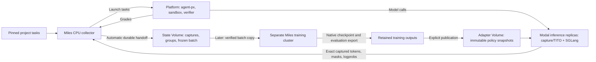

# Modal collect-then-train: platform rollouts, frozen batches and independent Miles steps

Use this workflow to collect expensive platform rollouts once, keep their exact
training data on a Modal Volume, and run an optimizer step in a separate job.
Sampling and training can happen at different times and use different GPU fleets.
**Sampling-only needs inference GPUs, but no training GPU cluster.**

The reusable shape is:

1. Pin the tasks, behavior policy, harness, sampling settings and training recipe.
2. Bring up compatible inference replicas and register their endpoint with the platform.
3. Run the Miles CPU collector with Volume persistence enabled.
4. Validate its saved batch, or explicitly assemble a different selection.
5. Allocate a training cluster later and consume that immutable batch.
6. Persist the new native checkpoint; publish its serving adapter when ready to evaluate.

The collector automates persistence and final batch creation. The standalone
training command runs **inside an already provisioned training environment**;
cluster allocation and committing its output remain the launcher's responsibility.
This guide describes the existing architecture, not a new orchestration layer.
See [offline-batches.md](offline-batches.md) for detailed freeze/assembly contracts.

## Who does what



| Component | Responsibility |
| --- | --- |
| Miles CPU collector | Selects tasks, bounds concurrency, launches platform runs, retrieves captures and grades, builds complete groups, and commits their artifacts. It owns a local Postgres index during collection. |
| Platform / agent-px | Runs the harness and tools in sandboxes, grades attempts, and owns sandbox cleanup. |
| Inference replica | Runs SGLang and the Miles capture/gateway process together. Capture preserves exact token IDs across turns (TITO), behavior logprobs, and assistant loss masks. |
| Later Miles trainer | Reads frozen samples and runs native advantage computation, loss, backward, optimizer update and checkpoint save. It needs no live platform, capture service or rollout database. |

In this Modal topology, **agent-px calls the inference replica directly**. Model
calls do not travel through the training GPU node. Session affinity keeps a
rollout's calls on the replica holding its capture session. A replica disappearing
can still lose an unsealed session; affinity is not durable session recovery.

All replicas mount the same adapter Volume. A policy names an immutable snapshot
hash; replicas load that version into a local LoRA slot. A rollout stays pinned to
its selected policy, and every member of a training group shares that policy.
Fixed-policy collection never updates weights while collecting. The continuous
async training path can publish new versions while older rollouts finish; that is
a different run mode from the manual collect-then-step workflow here.

## Three Volumes, and the identities to keep

| Storage | Config owner | Contents |
| --- | --- | --- |
| Base Volume | `serving.json: base_volume` | Pinned base weights and tokenizer, available at the configured model path. |
| Adapter Volume | `run.json: volume` | Immutable PEFT-compatible serving snapshots, shared by inference replicas. |
| State Volume | `training.json: state_volume` | Durable rollout artifacts, collection batches and training recovery state, namespaced by `run_id`. Mounted at `/snapshot` by the Modal launcher. |

Native Megatron checkpoints contain the per-rank training weights and
optimizer/scheduler/RNG state needed to resume. A serving adapter alone is not a
resumable training checkpoint. Keep both when you want to evaluate **and** continue
training. Keeping a Volume does not require keeping a GPU alive.

Record the code commit/image, run ID, collection ID, policy snapshot hash, batch
path/hash, output experiment path and owned Modal app IDs. A collection ID names a
collection invocation; it is not a new policy version or a new training run.

## 1. Prepare the contract and the serving fleet

Work from the Miles repository root in the configured Miles/Modal environment.
Use local `run.json`, `serving.json` and `training.json` files. The model recipes in
[examples/proximal](../../examples/proximal/) are starting points: review their
context limits, GPU layout and research choices instead of treating them as the
configuration of a previous experiment.

- `run.json` pins project tasks and their images/commits, harness revision and
  limits, base model, tokenizer/rendering, thinking/tool protocol, LoRA targets,
  rank/alpha, sampling, group size and behavior correction. Set
  `research.unused_groups` to `retry` for finite collection.
- `rollout_sandbox` chooses where the platform runs each rollout. The examples use
  `gvisor` (a Kubernetes sandbox under gVisor). `kata-clh` and `kata-qemu` (Kata on
  Kubernetes) and `ecs-fargate` remain available; the field has no default.
- `research.sampling.logprob_semantics` fixes what a behavior logprob means.
  `untransformed` samples the full distribution (`top_p` 1, `top_k` -1).
  `sampling_support` samples with top-p/top-k (for example `top_p` 0.95 with `top_k`
  20): collection then saves each generated token's surviving token set with the
  rollout, and every training step here (`offline_batch train`, the sweep launcher)
  replays it ([architecture](architecture.md)). It needs a serving SGLang build that
  returns sampling masks; the preflight canary checks this before the first platform
  rollout. Speculative serving (NEXTN/EAGLE, `speculative_eagle_topk` 1, default
  verification) returns them through `docker/patch/sglang_spec_sampling_mask.patch`,
  which `serving_app` applies over the pinned image's SGLang (the deploy fails if the
  image's SGLang is a revision the patch doesn't fit); SGLang rejects mask requests under rejection sampling or tree drafts, which fails the
  canary. The setting is part of the training contract, so batches collected under
  the two settings never mix, and rollouts collected `untransformed` cannot be
  trained with replay.
- `serving.json` chooses the replica hardware, engine image, precision/cache
  settings, context ceiling and replica bounds. `max_in_flight_samples` in the run
  config bounds active rollout samples across the collector; Modal request
  concurrency is a different quantity. Choose capacity from measurements for the
  actual context lengths, rather than multiplying a short-request benchmark.
- `training.json` provides the state Volume, secrets and explicit Miles model and
  optimizer recipe. The CPU collector uses it to save `training-args.json`; the
  presence of training GPU settings does not allocate those GPUs in collection mode.

Base/adapter/state Volumes, staged model files and required secrets must already
exist. Keep one active collector/trainer writer per run. Check the configs locally:

```bash
python -m miles_plugins.proximal.runtime validate --config run.json
python -m miles_plugins.proximal.training check --config run.json --training training.json
```

For a new serving fleet, the operator deploys it with:

```bash
PROXIMAL_RUN_CONFIG=run.json PROXIMAL_SERVING_CONFIG=serving.json \
  modal deploy --env main -m miles_plugins.proximal.serving_app
```

This is a paid serving operation. Use the intended Modal profile/environment and
record the app ID. Register that pool URL as the platform's `rollout_capture`
endpoint, with the matching wire model and token budgets; the run's `inference_url`
and `capture.url` must point to the pool. See the
[model setup example](../../examples/proximal/qwen38/README.md) and
[serving instructions](../../miles_plugins/proximal/README.md#2-deploy-the-miles-owned-serving-pool).
An existing compatible fleet can be reused. Collection waits for platform endpoint
registration, checks serving compatibility and runs a capture canary before tasks.

**Choose the later initialization before paying for a large collection:**

| Starting policy | Collection choice | What the later trainer needs |
| --- | --- | --- |
| Fresh pinned base | `--fresh`: publish a zero-delta serving adapter on CPU | The batch's retained zero-delta proof; initialize trainable LoRA and a new optimizer from the base. |
| Existing trained policy | `--policy-file policy.json`: use its published immutable snapshot | A compatible, verified native recovery checkpoint, plus the batch and base weights. |

**Current fresh-bootstrap limit:** `initial_policy.py` rejects scoped/wildcard
LoRA targets. In particular, the current Qwen3.8 full-LoRA template cannot be fed
directly to CPU `--fresh`. Do not remove target scoping just to get past validation.
Full-LoRA training/export exists, but this CPU bootstrap path is not implemented.
The separate base-batch comparison launcher can deliberately train different target
sets from a verified base-policy batch; see the final section below.

## 2. Collect and persist automatically

For a supported fresh-base contract, run:

```bash
PROXIMAL_RUN_CONFIG=run.json PROXIMAL_SERVING_CONFIG=serving.json \
PROXIMAL_TRAINING_CONFIG=training.json \
  modal run --detach --env main -m miles_plugins.proximal.modal_training \
  --collect-rollouts 1024 --rollouts-persist-to-volume \
  --collection-id collection-001 --fresh --yes-rollouts --yes-publish
```

For an existing trained policy, replace `--fresh` with `--policy-file policy.json`.
The policy must belong to the configured run/base and already be published. These
consent flags authorize rollout and publication work; they do not start an optimizer.

`1024` counts accepted samples in complete groups, not groups, concurrent requests,
or billed attempts. With explicit group size 8 it means 128 groups. Failed rollouts
cause additional paid attempts: each is relaunched in its group as soon as it fails,
and a group that runs out of relaunches (`group_size` per group) is retried whole.
The finite collector stores all complete groups,
including all-fail/all-pass groups; it does not apply online dynamic sampling.

Persistence happens incrementally: request intent before launch, then each accepted
capture and grade before releasing its replica capture, then complete group bytes
and indexes. The job automatically freezes and commits a self-contained batch once
the requested number of complete groups arrives. No end-of-run manual save is needed.

On the state Volume:

```text
RUN_ID/
  artifacts/RUN_ID/accepted/ATTEMPT_ID/  # tokens, masks, logprobs, grade/provenance
  artifacts/RUN_ID/groups/              # complete group payloads and indexes
  collections/COLLECTION_ID/
    source.json                        # exact source run contract
    policy.json                        # exact behavior policy
    training-args.json                  # explicit model/optimizer recipe
    base_policy/                       # zero-delta proof, for fresh collection
    batch/
      batch.json                       # ordered membership and checksums
      groups/GROUP_ID.bin               # copied training payloads
      base_policy/                     # proof copied into fresh batches
```

Wait for `Collection ready: COLLECTION_ID` and validate the batch from a fresh
Volume reader (reload the mount or download a complete copy first):

```bash
python -m miles_plugins.proximal.offline_batch check \
  --bundle /snapshot/RUN_ID/collections/COLLECTION_ID/batch
```

Success reports the sample/group counts and policy hash. Low GPU activity, a
platform grade or a stopped collector is not proof of a durable training batch.
After completion, the operator may stop owned serving replicas; the collector does
not automatically stop a separately deployed serving app. Platform sandbox teardown
stays with the platform. Preserve the Volumes.

If collection is interrupted, reuse of the same collection ID refuses to relaunch
unfinished paid work; it does not resume volatile sessions. Reconcile committed
groups with `freeze`, then collect only the deliberate top-up under a new collection
ID. Do not blindly replace the run/collection IDs and start the whole job again.

Durability begins at the acknowledged Volume handoff. A hard collector/replica loss
before that can lose tokens, even for a graded rollout. Individual saved captures
survive a missing group index, but current batch recovery requires complete groups;
automatic reconstruction from individual captures is not implemented. See the
[failure-boundary table](offline-batches.md#exact-durability-boundary).

## 3. Choose the actual training batch

The automatic collection batch is ready to use as-is. If you want a different
selection, recovered partial collection, or groups from top-ups, explicitly
`freeze`/`assemble` a new immutable batch using
[the assembly reference](offline-batches.md#combining-a-saved-batch-and-a-top-up).
Validate it with `offline_batch check` before training.

For binary-reward GRPO, a mixed pass/fail group provides within-group reward
variation. Collecting 128 groups does not guarantee 128 mixed groups. Assembly can
require nonzero reward variance; it fails if the selection cannot satisfy that
requirement. It never silently pads a batch. Outcome-based selection and reuse of
known failures are research choices that change the sampling distribution.

Every selected group must satisfy the exact behavior-policy and compatible source
contracts. Keep the original payloads; selection does not delete rejected groups.
Manually assembled output also needs a durable commit before its host is stopped:
the CLI alone does not commit a Modal mount. The collector's automatic publication
path does. Keep the saved training recipe alongside any assembled batch.

## 4. Run one separate optimizer step

Allocate the intended Miles/Megatron/Ray cluster separately; the
[Modal training cluster guide](modal-training-clusters.md) covers the existing
launchers, allocation, warm recovery and verified shutdown. Provide the pinned
base weights/tokenizer, frozen batch, saved recipe and (for resume) native checkpoint
at paths available to all workers. Provision host RAM for the full decoded batch.
For resume, the native checkpoint's parallel layout must match; optimizer resharding
from 8 to 64 GPUs is not supported by this path.

**Stage and verify inputs onto node-local disk before training.** Train from that
stable copy, especially when a publisher also reloads the Volume. Reading training
inputs from a mount being reloaded caused the original sweep's step-2 failure.
The sweep launcher already performs hash-verified staging; a custom single-step
launcher must provide it or otherwise guarantee immutable, stable input visibility.

Inside that environment, with a fresh-base batch:

```bash
python -m miles_plugins.proximal.offline_batch train \
  --bundle /work/batch --recipe /work/training-args.json \
  --fresh --yes-train -- --save /work/output/step-001
```

For a previously trained policy, use a verified run-state recovery bundle:

```bash
python -m miles_plugins.proximal.offline_batch train \
  --bundle /work/batch --recipe /work/training-args.json \
  --checkpoint /work/recovery --optimizer-state resume --yes-train \
  -- --save /work/output/step-001
```

`/work/recovery` is the copied `checkpoints/STEP-DIGEST` bundle with its manifest and
native shards, not an adapter-Volume snapshot. Use the matching saved recipe, with
explicit seed/optimizer/learning rate and the intended supported GPU layout. Review
the resolved arguments; example recipe defaults are not the last experiment's settings.

The wrapper validates the batch and initialization, derives its group/sample counts,
and supplies frozen samples to ordinary Miles `train.py` for exactly one update.
Fresh mode verifies the zero-delta proof and initializes a new trainable LoRA; resume
restores native weights and optimizer/scheduler/RNG. The wrapper does not publish a
new online policy or update the original run's consumption ledger.

**Before stopping the cluster, the launcher must persist the output.** The standalone
command does not run the online state writer. Retain every rank's native adapter and
training-state shard, native completion metadata, serving export, recipe, source
batch identity and logs. Publish a verified recovery bundle if the next invocation
will use `--checkpoint`; a raw `--save` directory is not that bundle. Use the existing
[checkpoint publication machinery](../../miles_plugins/proximal/state_checkpoints.py).
Commit output bytes before completion metadata, then verify from a fresh reader.
Only afterward stop the owned training compute.

## 5. Evaluate, continue, or compare configurations

Package/publish the new serving export through the existing immutable snapshot path,
then evaluate that exact policy hash. Resume training from the native checkpoint,
not by importing the PEFT serving export. A manual step does not automatically
replace the replicas' policy or start another collection.

The saved batch can be retained for repeated training-loop experiments. Reusing it
is deliberate offline replay; it is not a fresh round of on-policy RL. Declare the
behavior correction and permitted lag rather than rewriting its provenance.

For the multi-configuration experiment, the existing
[`e2e.batch_sweep`](../../miles_plugins/proximal/e2e/batch_sweep.py) launcher owns a
Modal cluster, local input staging, per-step native/output publication, bounded
worker retries and allocation retention. Its
[`SweepPlan`](../../miles_plugins/proximal/e2e/batch_sweep_inputs.py) declares the
batch hash, recipe, targets and initialization for each phase. It is specifically
a two-update-per-configuration comparison, with an optional committed first-update
resume; it is not a generic one-step allocator. Select `B300:8` or `B200:8` in
`training.json.gpu`. The B200 Qwen3.8 sweep resolves and records its tested
TP4/CP2 memory recipe before validation; see the
[hardware settings and 1024-sample accumulation example](modal-training-clusters.md#build-and-review-the-sweep-plan).
The [architecture](architecture.md) defines its recovery and lifetime rules.

The workflow is complete when another process can validate the retained input
batch, identify the exact training recipe and policy, and load the output needed
for the next action: native state for continuation, serving snapshot for evaluation.
