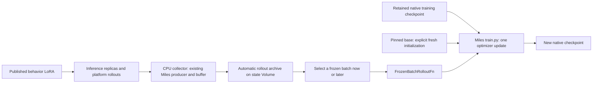

# Collect now, train later

The data already saved by the platform integration is sufficient for an independent
training step. Use **complete groups**: their v2 codec contains verifier rewards
as well as tokens, masks, logprobs and provenance. An individual accepted capture
contains the token trace and separate grade evidence, but is not a complete GRPO group.



Collection and training can be different processes at different times. Collection
does not need training GPUs; the later trainer does not need inference replicas,
platform access, capture credentials or Postgres. This does not make the data
automatically on-policy: choose the native checkpoint that corresponds to the
behavior policy, or deliberately use the configured behavior correction and lag.

## P0: one flag enables durable rollout storage

Use the usual run, serving, and training deployment configs. The existing
`training.json` supplies the state Volume and secrets. The base weights and
inference fleet must already exist; this command creates **no training GPU**:

```bash
PROXIMAL_RUN_CONFIG=run.json PROXIMAL_SERVING_CONFIG=serving.json \
PROXIMAL_TRAINING_CONFIG=training.json \
  modal run --detach --env main -m miles_plugins.proximal.modal_training \
  --collect-rollouts 1024 --rollouts-persist-to-volume --fresh \
  --yes-rollouts --yes-publish
```

`--fresh` creates a serving-only zero-delta adapter from the pinned base checkpoint's
tensor shapes on CPU. It publishes through the existing immutable snapshot path.
No old training checkpoint is required. For an existing trained policy, replace
`--fresh` with `--policy-file policy.json`; retain its native checkpoint for the
later optimizer resume. Use one active producer/writer per run, as for online training.

The CPU job starts its own local Postgres and artifact publisher. The flag uses
the deployment's **state** Volume, not the serving adapter Volume. Online Modal
training already uses this publisher; the same flag is accepted on its ordinary
launch command. Persistence is independent of whether a rollout is selected for
training. Each launch request is archived before platform execution, and each
accepted result is committed before its replica capture is released. Failed or
cancelled attempts retain an explicit outcome and any recoverable sealed capture;
unrecoverable/unknown results never become fabricated training samples.

The job prints a collection ID and writes:

- `<run_id>/artifacts/<run_id>/accepted/<attempt_id>/`: request, exact token codec,
  and acceptance/grade or failure evidence.
- `<run_id>/artifacts/<run_id>/groups/`: complete training groups, preserving exact
  tokens, masks, behavior logprobs, rewards, membership and policy provenance.
- `<run_id>/collections/<collection_id>/`: source config, policy, explicit training
  recipe (`training-args.json`), optional initial
  base-policy proof, and an automatically finalized `batch/` after 1,024 accepted
  samples. Group size comes from the run config; 1,024 is not a cap on billed attempts.

Results are saved incrementally, before a batch exists. A storage failure holds
completion until publication succeeds; a crash can still lose an unsealed capture,
which remains explicitly unknown/failed. After an interrupted collection, committed
groups and source metadata remain usable without its Postgres. No manual copy or
Volume commit is needed on the supported Modal collection path.

For this P0, the existing lossless sample codec is unchanged. Complete groups and
self-contained batch exports duplicate payloads; deduplication/compression is not
part of the correctness change.

## What the two Claude investigations established

- Thread `679f3eca-1c0d-4e34-952a-20efde8526c6`: PR #21 measured a **synthetic**
  1,024-sample step on 64 B300s (TP4/DP16). That proves the tested shape fits,
  not that 1,024 production rollouts were trained independently. PR #23 removed
  unintended MTP training; PR #24 investigated context parallelism.
- Thread `8d757ffc-7bb2-47f8-8c01-19336cbf62a1`: the gradient-attribution harness
  reads saved run-013 groups, derives a step's groups from consecutive cursors,
  and feeds real samples through native Miles replay. This confirms the existing
  artifact carries the needed fields. It is a diagnostic harness with reward/LR
  changes, not the supported independent-step command here.
- Run-013 predates the MTP fix. Its adapter checkpoints include MTP parameters;
  replay on code that removes those parameters is a model migration, not an
  ordinary resume. Keep the correct code/image for historical investigations.

## Collect a finite batch

The lower-level local collector below is useful when managing the CPU process
yourself. For Modal, prefer the single command above, which owns persistence.
First provision/retain the inference fleet and commit the chosen policy through
the existing publication path. Keep the **native training checkpoint** for that
policy as well. Pin a recovery bundle with `pins/<checkpoint-id>` under its run
root and commit the Volume before allowing the normal writer to prune it.

Use a dedicated collection namespace/store without a concurrently publishing
trainer. The run JSON must match the serving contract and the selected policy's
run ID. It needs the usual platform/capture credentials and Postgres DSN.
For this lower-level command, use `shared_disk` on a persistent local filesystem.
Do not collect directly into a Modal v1 mount: local immutable staging needs
hardlinks. The supported Modal launcher stages locally and uses verified copy plus
commit for Volume publication. `run_state` requires its run-owned publisher.

```bash
python -m miles_plugins.proximal.collect_batch \
  --config collect.json --policy policy.json \
  --samples 1024 --out /artifacts/batches/batch-001 \
  --yes-rollouts --yes-publish
```

The current `AuthorizedRun` capability requires both consent flags; this command
does not publish. Group size remains the explicit value in `collect.json`.
With group size 8, the result contains exactly 128 complete groups. The producer
may start more than 1,024 attempts due to retries/concurrency. Shutdown closes the
producer and requests logical cancellation for unfinished work; the platform owns
sandbox cleanup. The inference fleet's lifetime remains the operator's.

Completed group IDs are recorded incrementally in `selection.json`. A failed
collection leaves its paid complete groups available; it cannot create a final
`batch.json` until the full requested batch has been copied and validated. To
recover a partial collection, choose the desired complete group IDs explicitly
and use `freeze` below. It does not silently pad, duplicate or resample missing data.

## Freeze already gathered data

No services or GPU required. `groups.json` is an ordered JSON array of group IDs;
`policy.json` is the recorded `Policy` (run ID, version, snapshot hash, base model).
This first pass requires all selected groups to name that exact behavior policy.
For older runs, the original `.bin` payloads work without the new `.json` sidecars.

```bash
python -m miles_plugins.proximal.offline_batch freeze \
  --config source-run.json \
  --source-root /snapshot/RUN_ID/artifacts/RUN_ID \
  --group-ids groups.json --policy policy.json --samples 1024 \
  --out /local/batch-001

python -m miles_plugins.proximal.offline_batch check --bundle /local/batch-001
```

To select from committed indexes without preparing a group list, replace
`--group-ids groups.json` with `--oldest`. Selection still requires the exact policy
and requested number of complete groups; it fails if there are too few. For fresh
training, also pass `--base-policy` pointing to the collection's saved `base_policy/`.

The bundle contains `batch.json` and `groups/<id>.bin`. It is self-contained data:
source paths/DSNs are provenance, not live dependencies. Freeze copies unchanged
codec bytes one group at a time, validating checksums, complete-group membership,
reward evidence, masks and policy provenance. It introduces no giant pickle or
new tensor format. A bundle is a deliberate copy and therefore takes additional
storage. Commit/upload the complete directory before stopping its producing host;
for a mounted Modal Volume, the host must commit and later readers must reload.
Use one writer per output bundle. Payloads and the final manifest use verified
copy-and-rename, as recovery bundles do; Modal v1 rejects the local immutable
writer's hardlink operation. Retrying identical files succeeds; conflicting
committed files fail validation.
See [Modal Volume visibility](https://modal.com/docs/guide/volumes#volume-commits-and-reloads).

## Execute one separate training step

For a fresh Qwen run collected by the command above, mount the state Volume on the
later training cluster at `/snapshot` and use its printed collection ID:

```bash
python -m miles_plugins.proximal.offline_batch train \
  --bundle /snapshot/RUN_ID/collections/COLLECTION_ID/batch \
  --recipe /snapshot/RUN_ID/collections/COLLECTION_ID/training-args.json \
  --fresh --yes-train -- --save /output/independent-step
```

The saved recipe supplies model, optimizer, seed and parallelism arguments. The
wrapper derives exactly one update and the batch size from the validated data.
`--fresh` verifies the retained serving policy has zero delta, then initializes
Megatron's **trainable** LoRA with nonzero A and zero B, plus a fresh optimizer.
It never imports the serving adapter into the trainer. The output directory must
be empty, separate from the input bundle and base weights.

For native resume, use the same pinned model/code/image and checkpoint layout. The input is
a verified recovery directory `checkpoints/<step>-<digest>` from this PR, not
the adapter Volume's `snapshots/<digest>`. Mount it and the batch read-only on the
trainer's Ray nodes. Keep the pinned base/tokenizer at the recorded container path.

Inside the existing training image/cluster, run the command below, replacing the
final placeholder with the recipe's actual model/optimizer/parallelism arguments:

```bash
python -m miles_plugins.proximal.offline_batch train \
  --bundle /batches/batch-001 \
  --checkpoint /snapshot/RUN_ID/checkpoints/STEP-DIGEST \
  --optimizer-state resume --yes-train \
  -- --save /output/independent-step MODEL_OPTIMIZER_AND_PARALLELISM_FLAGS
```

This is an in-cluster command, not a Modal deployment command. It does not allocate
a cluster. Do not use the online platform launch flags (`--fully-async`, platform
data source, external rollout fleet, custom weight publisher). The wrapper supplies
the ordinary frozen rollout input and train-only flags; keep the model/optimizer
recipe explicit. Changing the optimizer algorithm is not supported by a native
optimizer restore. Scheduler changes follow Miles's existing resume semantics.

Before calling the driver it validates the entire batch, checkpoint hashes, run
contract, lag window, GPU count/layout, LoRA shape and one-update batch sizing.
For a checkpoint saved at step N, it runs rollout iteration N+1 once and saves
through native Miles checkpointing. That operation does not update the original
run's online consumption ledger or publish the new adapter. The cluster owner must
persist/commit `/output`; the continuous trainer's state-writer thread is not running
in this standalone command. Preserve the input bundle and checkpoint ID with the output.

Native Miles still loads a whole batch into host memory. Streaming the freeze
process bounds preparation memory; it does **not** turn the trainer into an
out-of-core loader. Provision host RAM for actual lengths as in the sizing work.

## Explicit first-pass limits

- Serving exports use PEFT-compatible LoRA files for SGLang. Native trainer
  checkpoints use Megatron's per-rank layout and retain optimizer state. Both
  describe the same learned adapter in different forms; neither format is a
  numerical precision choice.
- The current Megatron loader cannot import the published PEFT weights. Retaining
  only an old serving version is insufficient for this training command. Keeping
  its native checkpoint solves this; it does not require changing serving.
- Fresh mode requires the batch's verified zero-delta base-policy proof; native
  resume requires a verified native checkpoint. An arbitrary trained PEFT adapter
  cannot stand in for either. Historical legacy recovery
  directories lack the new proof and remain available through the existing diagnostic
  replay harness; their group payloads can still be frozen and checked here.
- Native optimizer resharding from 8 to 64 GPUs is **not** implemented/proven here.
  Collection is independent of the trainer topology; checkpoint loading is not.
  A resumed 64-GPU independent step needs a compatible native checkpoint on that topology;
  a fresh step initializes directly on its chosen supported topology.
- This first pass is fixed-policy collection and one optimizer update, not repeated
  offline RL over the same batch or mixed-policy historical replay.
- The CPU tests prove real codecs, provenance validation, complete-group ordering,
  reward normalization and service independence. The [live GPU verification](state-gpu-verification.md)
  also trained 1,024 real saved rollouts across separate Modal containers and
  reproduced native weights, optimizer/scheduler/RNG, training data and serving
  exports exactly. That evidence is for BF16 Qwen3-0.6B, rank 32, one H100;
  large-model and multi-GPU continuation remain separate gates. The new CPU-only
  bootstrap and persistence flag have CPU coverage; they have not yet been used
  for a new live 1,024-rollout platform collection/GPU step.

Adversarial CPU coverage injects repeated cancellation during logical cancellation,
capture retrieval and terminal publication; disk-full errors; failed commits and
lost acknowledgements at both publication stages; and file changes after validation.
It also checks exact multi-turn masks/logprobs after source removal and rejects
native optimizer corruption, reset flags, incompatible layouts and output paths
overlapping inputs. These tests use real Postgres/files/codecs with a simulated
Volume commit; they do not certify live Modal mount behavior or GPU numerics.
