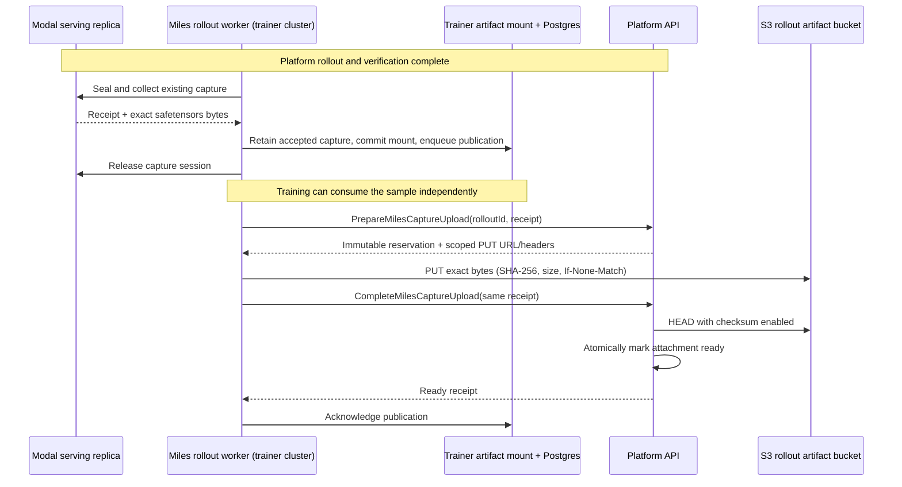

# Proximal platform contracts: capture routing and rollout archive

The original routing contract was audited against proximal-mono `origin/main` `593de5e46063`. Run execution still uses the existing APIs. Rollout-end archive publication additionally requires proximal-mono PR #4821, described below. Deploy those RPCs before relying on platform archive availability; older platforms leave uploads pending without changing training.

## What Miles sends and reads (no change)

Miles creates one platform run per attempt with the existing `EnvironmentRunService.CreateEnvironmentRun`, using only existing fields:

```json
{
  "runId": "<attempt id: deterministic, retries are idempotent>",
  "environmentId": 123, "imageId": 456, "sourceCommitSha": "<40-hex>",
  "instances": 1,
  "ensureRolloutLaunchWorkflows": true, "autoTriggerAnalysis": false, "autoTriggerPostQa": false,
  "config": {
    "agents": [{
      "agentType": "<mini-swe harness>",
      "agentModel": "<run config platform_route.model>",
      "endpointName": "<run config platform_route.endpoint_name>",
      "agentTimeoutSec": 1800,
      "reasoningEffort": "AGENT_REASONING_EFFORT_HIGH"
    }],
    "harborOptions": {"maxTurns": 60, "maxSessionTokens": 32768, "p2pEnforce": true}
  }
}
```

It reads results with the existing `GetEnvironmentRunContainers` (status, `rolloutIndex`, `agentType`, `rewardScored`, `reward`, `error`) and `GetRunSummary` (`imageId`, `sourceCommitSha`), and checks project membership with `ProjectService.ListProjectEnvironments` before the first run. `StopEnvironmentRun` is a logical cancel; Miles never tears anything down.

Eligible: `SUCCESS`/`COMPLETED`, no execution error, `rewardScored` (a scored zero is valid). Anything else is an execution failure and never becomes a zero-reward sample.

## The change: a rollout capture entry in the Modal endpoint registry

Implemented in proximal-mono (`packages/backend/src/core/llmRuntime/modal`). The existing registry (LiveConfig `modal.inference.endpoints`) gains a second, tagged entry kind:

```json
"miles/stage-a": {
  "defaultEndpoint": "capture",
  "endpoints": {
    "capture": {
      "kind": "rollout_capture",
      "mode": "dedicated",
      "baseURL": "https://<capture host>",
      "model": "Qwen/Qwen3-0.6B",
      "apiKeyEnv": "MILES_CAPTURE_PLATFORM_KEY"
    }
  }
}
```

1. **`miles/<name>` models** (lowercase `[a-z0-9._-]`) are recognized as a model family that routes through the registry; they are not catalog models, and a run without a registry entry fails at its boundary. They accept the platform's reasoning-effort names.
2. **A `rollout_capture` entry selects agent-px's Chat Completions adapter** instead of the Modal Responses provider. A Modal model never resolves to a capture entry, and a Miles model never to a Responses entry.
3. **Per-rollout base URL**: `${baseURL}/rollouts/${rolloutId}/v1`, where `rolloutId` is the platform rollout ID, `<run id>-rollout-<index>`. Miles creates one-instance runs whose run ID is the attempt ID, so the capture service maps `<attempt id>-rollout-0` to the attempt it registered.
4. **Credential by reference**: `apiKeyEnv` names a variable the rollout workers must have; its value (the capture service's `platform_key_env`) is sent as `Authorization: Bearer <key>`. Only the name is stored in config and in the per-run assignment snapshot.
5. **`baseURL`** is HTTPS, or plain HTTP to `127.0.0.1`/`localhost` for a capture service on the worker's own host.
6. **Budgets are ceilings** (131,072-token context, 16,000 output tokens for the family). The capture service applies the training contract's smaller per-turn budget and sequence limit, and Miles sets `maxSessionTokens`.
7. **Sampling parameters are not sent**; the run's reasoning effort is sent as `reasoning_effort`.

The per-run endpoint snapshot (`modal_endpoint_assignments`) already pins the entry for a run's lifetime; the rollout URL is derived from the snapshot and the rollout ID, so nothing new is persisted. Register an entry with `packages/backend/scripts/modal/switch-endpoint.ts --kind rollout_capture --api-key-env <NAME>`.

## What the capture service accepts from agent-px

Read from agent-px at the pinned commit; covered by Miles's tests.

- Streaming requests with `stream_options.include_usage`: the reply is one SSE chunk with the full message and usage, then `[DONE]`. The engine call itself is never streamed.
- `prompt_cache_key`, `prompt_cache_retention`: ignored (no effect on sampling).
- `reasoning_effort`: must equal the run config's `model_protocol.reasoning_effort` (sent as `agents[].reasoningEffort`); otherwise 422. Not forwarded: the TITO renderer owns thinking.
- `max_completion_tokens` (or `max_tokens`): a ceiling; the training contract's per-turn budget applies when smaller.
- Tools with `strict: true`: `strict` is removed before the engine. With it, SGLang constrains decoding to the schema, and behavior logprobs would come from a different distribution than training computes.
- No `temperature`/`top_p`/`top_k`: the capture service applies the training contract's sampling.
- Replayed history as agent-px rebuilds it: `content: null` on tool-only turns, `reasoning_content`, compact re-serialized tool arguments. Miles's `loose_tool_call` matcher accepts JSON-equivalent arguments, so the prefix tokens come from the session's own record and nothing is rolled back.
- A history agent-px rewrote differently (unparseable arguments replayed as `"{}"`, the truncated-reasoning placeholder) does not match. Miles then rolls back one turn and re-renders it as context: that turn's tokens are not trained, the rest are.

## Harness and limits

The first supported harness is **mini-swe**: it disables compaction, so every rollout is one linear token history. `maxTurns` and `maxSessionTokens` come from `harborOptions`. The default harness compacts with a separate summary request and needs multi-segment samples; not supported yet.

## Deliberately not required (follow-ups)

The earlier proposal also had a `GetTrainingCapabilities` RPC, a per-run training binding with a per-session URL and key, and a stored request fingerprint echoed on `CreateEnvironmentRun`/`GetRunSummary`. They are dropped from the first version:

- **Routing is proven by the capture service.** A run whose calls never reach the capture service has no captured tokens, so its sample is rejected, not trained.
- **Harness revision is operator-asserted.** The run config pins it as part of the training contract, but the platform does not certify which revision executed. Certifying it (capability or summary field) is the main follow-up.
- **The run ID binds the grade to the attempt**, together with image and source commit from `GetRunSummary`.

## Reachability

The rollout workers that run agent-px must reach the capture service URL. With a local platform worker on the same host, loopback works (the offline Stage A harness does this). Against staging, the capture service needs a public HTTPS URL, e.g. deployed as a Modal `app.server` next to the serving pool.

## Platform test checklist

- A `rollout_capture` entry builds `${baseURL}/rollouts/${rolloutId}/v1` and uses the credential reference; no fallback to another provider or the global Modal key.
- The rendered key never appears in logs, traces, run metadata or the persisted endpoint snapshot.
- A run with `agents[].endpointName` for that entry sends every mini-swe model call there, with `agents[].reasoningEffort` as `reasoning_effort`.
- Existing Modal Responses endpoints are unchanged.
- One capped live rollout (e.g. `maxTurns` 3) reaches a Miles capture service and returns a scored container.


## Miles rollout capture archive

The platform archives Miles's existing, sealed `samples.safetensors` **once per
accepted rollout**. Exact input/output IDs, loss masks, behavior logprobs and policy
spans remain authored by Miles's SessionCore and sample codec. The platform neither
re-tokenizes nor re-encodes the tensor payload. Inference calls keep their existing
streaming protocol and perform no archive uploads or catalog writes.



## Platform contract and ownership

The three RPCs live on `proximal.v1.EnvironmentRunService`:

- `PrepareMilesCaptureUpload`: `{ rolloutId, receipt }` reserves one immutable
  receipt. Returns `{ attachment, uploadUrl, uploadHeaders }`; a ready retry needs
  no upload. The signed PUT expires after 15 minutes, covers one key, requires the
  declared checksum/length and forbids overwriting an existing object.
- `CompleteMilesCaptureUpload`: same input. Verifies actual S3 SHA-256 and byte
  count before setting `attachment.state = "ready"`. Caller metadata alone is
  insufficient. Identical retries succeed; conflicting identities fail.
- `GetMilesCapture`: `{ rolloutId }` returns the attachment (absent before prepare,
  `pending` before commit, `ready` after verification) and a 15-minute download URL
  only when ready. URLs are bearer capabilities and must not be logged.

The typed receipt contains `sessionId`, `requestSha256`, `payloadSha256`,
`trainingRunId`, `policyVersion`, `snapshotSha256`, `baseModel`, `baseRevision`,
`numCalls`, `numTokens`, `sizeBytes` (protobuf JSON uint64 decimal string).
This is **Miles-reported provenance**, not independent attestation of GPU weights.
The platform matches the base model against the persisted capture endpoint.

Only authenticated automation or full platform users may access these RPCs.
Publication requires an existing successful/completed rollout whose solver run
has a persisted `rollout_capture` endpoint assignment. A stored attachment remains
readable after operational journal/assignment retention. Ordinary Modal/provider paths
cannot publish. Initial scope is Miles's single-instance `<attempt>-rollout-0`.

The small reservation/attachment lives at `rollouts.miles_capture` in the existing
Mongo rollout document. The object lives in the configured `ARTIFACTS_BUCKET` at
`miles/rollout-captures/<rolloutId>/<receiptHash>/samples.safetensors`. No new bucket,
collection or lifecycle policy. It is separate from sandbox `artifacts_url` and
from the terminal agent journal; neither is overwritten or reopened. Discovery
and download are through the RPC, not a new journal event or token viewer.

## Failure and retry semantics

Archive status never rewrites solver status, verifier reward, or training
eligibility. Miles retains the exact accepted artifact on its existing artifact
mount, commits Modal Volume visibility, then inserts a Postgres outbox row before
releasing the replica session. An independent worker publishes at bounded
concurrency with backoff. Restarting the producer resumes pending rows. A lost PUT
acknowledgement yields 412 on retry; completion still verifies the existing object.
A lost completion acknowledgement safely repeats prepare/complete. No archive
failure initiates another rollout. Local files are retained after publication;
this change adds no garbage collector.

This first pass publishes **validated, graded captures only**. Failed/cancelled
rollouts currently have no accepted capture and get no fabricated attachment.
The durable handoff can delay sample return by a mount commit and local index
write; S3 publication is outside that path. Durable handoff failure is a local
infrastructure error and retains the replica session for diagnosis, subject to
its existing expiry. Replica loss before handoff remains the existing capture
failure mode. The artifact mount and Postgres must both survive trainer restart.

The maximum artifact is 5 GiB (one PUT). No compression is added: preserving the
sealed bytes preserves the receipt's checksum. No tensor arrays enter platform
Mongo/Postgres or API bodies. S3 permission requirements are PutObject, GetObject
and checksum-enabled HeadObject (plus the bucket's existing KMS permissions, if
applicable). Abandoned pending objects/reservations require an explicit future
retention policy; they are not silently collected by the agent-journal GC.

Spans `MilesCapture.*` and metrics `miles.capture.archive.operations` / `.bytes`
cover platform outcomes. Dashboard: `infra/datadog/dashboards/miles-capture.json`.
The trainer outbox exposes attempts, next retry time and last error class; logs
contain attempt IDs and error classes, never signed URLs or credentials.

### Replay without starting training

On a CPU process with the same artifact mount and Postgres credentials:

```bash
python -m miles_plugins.proximal.archive --config run.json --yes-rollouts --yes-publish --watch
```

This uses the existing run authorization but starts no inference, trainer, or
replica. Without `--watch`, it drains rows currently due; deferred retries remain
in the outbox and the command exits nonzero. Mount visibility and database retention follow the existing run
storage policy. Shutdown leaves pending rows intact for resume or this command.
